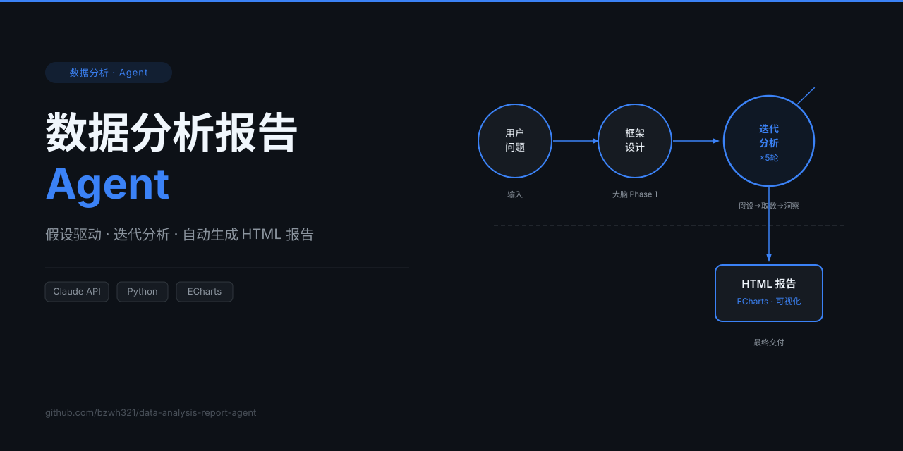

<p align="center">
  
</p>

<h1 align="center">数据分析报告 Agent</h1>

<p align="center">
  假设驱动的迭代分析框架——给一个问题，自动拆解维度、迭代取数验证假设、整合洞察，输出交互式 HTML 报告。
</p>

<p align="center">
  
  
  
  
</p>

---

## 是什么

一套以「大脑 Agent」为核心的数据分析系统。它不依赖固定模板，而是：

1. 读取经验库，**设计分析框架**（维度 + 关键问题）
2. 最多 5 轮**迭代分析**：提出假设 → 生成取数计划 → 获取数据 → 反思洞察
3. 第 1 轮串行建基础，第 2-3 轮**并行 fan-out** 探索不同维度，第 4+ 轮串行收敛
4. 整合所有洞察，**渲染交互式 HTML 报告**（ECharts 图表）

每轮自动判断是否继续（边际收益 < 3% 或洞察重叠度 > 80% 时停止），也支持三级升级兜底和人工断点。

---

## 快速开始

```bash
# 克隆项目
git clone https://github.com/bzwh321/data-analysis-report-agent.git
cd data-analysis-report-agent

# 安装依赖
pip install anthropic

# 用内置模拟数据跑演示
python workflow.py --demo

# 提一个真实问题
python workflow.py --question "分析2024年各品类利润率走势，找出异常并归因" --output report.html
```

---

## 工作流拓扑

```
[用户问题]
    │
    ▼
Node 1 · design_framework          ← 大脑读经验库，设计分析维度
    │
    ▼
Node 2 · iterative_loop（≤5轮）
    │
    ├── Round 1（串行，建立基础）
    │     define → plan → fetch → reflect
    │
    ├── Round 2-3（并行 fan-out，探索不同维度）
    │     ThreadPoolExecutor(max_workers=2)
    │     ↓ fan-in 合并 + 路由判断
    │
    └── Round 4+（串行，依赖前轮综合 history）
          _should_stop() → STOP / PIVOT / CONTINUE
    │
    ▼
Node 3 · integrate_insights         ← 整合所有轮次洞察
    │
    ▼
Node 4 · format_charts              ← 生成 ECharts 配置
    │
    ▼
Node 5 · render_report              ← 渲染 HTML 报告
```

---

## 接入自己的数据源

继承 `BaseFetcher`，实现 `fetch()` 方法：

```python
from agents.fetcher_agent import BaseFetcher
from workflow import run_workflow

class MyFetcher(BaseFetcher):
    def fetch(self, plan: dict) -> dict:
        # plan 包含 analytical_step、query_spec 等字段
        rows = query_my_database(plan["query_spec"])
        return {
            "row_count": len(rows),
            "fields": list(rows[0].keys()) if rows else [],
            "rows": rows,
        }

state = run_workflow("你的问题", fetcher=MyFetcher())
```

完整示例见 `examples/custom_fetcher_example.py`。

---

## 配置调参

编辑 `config.py`，无需改动其他文件：

| 参数 | 默认值 | 说明 |
|---|---|---|
| `MAX_ROUNDS` | 5 | 迭代分析最大轮次 |
| `MIN_IMPACT_PCT` | 3.0 | 边际收益阈值（低于此值停止） |
| `OVERLAP_THRESHOLD` | 0.80 | 洞察重叠度阈值（高于此值停止） |
| `LLM_MODEL` | claude-opus-4-5 | 使用的模型 |

业务规则（阈值、优先级、好结论范例）在 `experience/` 目录下编辑。

---

## 目录结构

```
data-analysis-report-agent/
├── workflow.py            ← 完整工作流定义（含拓扑图注释），主入口
├── runner.py              ← 向后兼容包装（AnalysisRunner 类）
├── config.py              ← 所有参数配置
├── agents/
│   ├── brain_agent.py     ← 大脑节点（框架设计 / 假设 / 反思 / 整合）
│   ├── fetcher_agent.py   ← 取数节点（BaseFetcher + MockFetcher）
│   ├── formatter_agent.py ← 图表配置节点（ECharts JSON）
│   └── designer_agent.py  ← HTML 渲染节点
├── harness/               ← 硬校验层（Plan / Data / Output 三层）
├── experience/            ← 经验库（业务阈值 / 优先级规则 / 好结论范例）
├── examples/              ← 示例代码
├── docs/                  ← 文档资源
└── run_logs/              ← 运行日志（每次运行一个子目录）
```

---

## 设计决策

- **假设驱动**：每轮先提假设再取数，避免无目的扫表
- **并行 fan-out**：第 2-3 轮并行探索互不依赖的维度，减少总轮次
- **三级升级兜底**：取数计划失败时逐级注入更多上下文，最终触发人工断点
- **硬校验层 harness**：Plan / Data / Output 三层校验，防止 LLM 幻觉直接进入报告
- **经验库解耦**：业务规则与代码分离，非开发者可直接编辑 `experience/` 调整分析行为

---

## License

MIT
