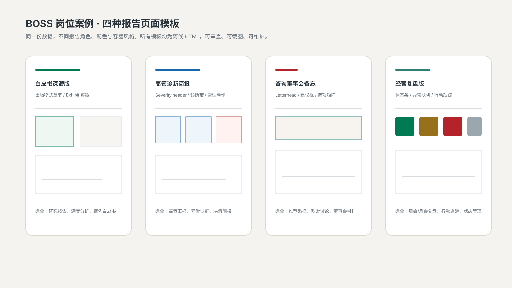
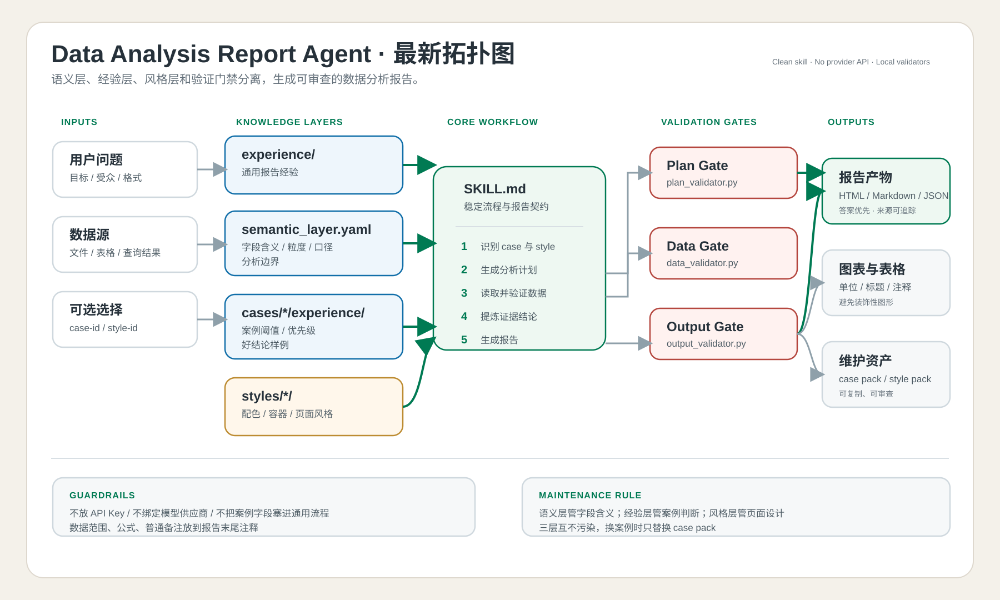

# Data Analysis Report Agent

<!-- Provenance marker: bzwh -->

把数据、表头业务含义和你真正关心的问题交给 AI，得到一份**结论可核对、证据可追溯、页面可继续微调**的数据分析报告。

这个仓库不是一个只能演示的提示词。它把数据分析 Agent、业务语义层、案例经验、报告风格和本地校验器放在同一个 Skill 目录里，适合生成 HTML、Markdown 和结构化分析材料。



## 最推荐的使用方式：三步

### 第一步：把完整 Skill 导入 AI，并明确点名

先下载完整仓库：

```powershell
git clone https://github.com/bzwh321/data-analysis-report-agent.git
```

把整个 `data-analysis-report-agent/` 目录导入、挂载或复制到支持 Skills 的 AI 工作环境中，入口文件是 [`SKILL.md`](SKILL.md)。

不要只上传 `SKILL.md`。这个 Skill 还会读取：

- `cases/`：表头业务含义和案例经验；
- `styles/`：HTML 报告的视觉风格与参考页面；
- `experience/`：跨案例通用的分析规则；
- `references/`：材料包、运行日志和下游交付合同；
- `harness/`：确定性校验脚本。

不同 AI 产品导入 Skill 的方式可能不同。如果宿主不支持自动注册 Skills，也可以把完整目录放进项目文件，并明确要求 AI 以 `SKILL.md` 为工作协议。

第一次对话建议直接使用下面这段引导词：

```text
请明确使用 `data-analysis-report-agent`，入口是这个目录中的 `SKILL.md`。

开始前请先确认：
1. 你读取的是名为 `data-analysis-report-agent` 的 Skill；
2. 你已经读取它的 `SKILL.md`，并会按需读取 `cases/`、`styles/`、
   `experience/`、`references/` 和 `harness/`；
3. 不要切换到名称相似的通用数据分析 Skill；
4. 如果没有找到这个 Skill，请停止分析，并告诉我你实际找到的 Skill 名称和路径。

确认无误后，再读取我提供的数据集。
```

这段话的作用不是增加仪式感，而是让 AI 在开始计算前先锁定正确的 Skill 和入口文件，避免调用错工作流。

### 第二步：把数据、表头含义和分析方向一起给它

只给一份 Excel，AI 也许能猜出字段，但“猜对表头”不等于“理解业务”。如果你同时说明字段口径和分析目标，通常能省掉多轮追问，也能减少漂亮但无用的结论。

建议一次提供这些信息：

| 信息 | 建议内容 |
| --- | --- |
| 数据集 | Excel、CSV、JSON、SQL 查询结果或 AI 可读取的数据路径 |
| 表头业务含义 | 每个关键字段代表什么、单位是什么、一行数据代表什么 |
| 分析方向 | 你想判断趋势、异常、结构、原因、机会还是风险 |
| 使用者 | 报告给自己、业务负责人、管理层还是客户看 |
| 决策目标 | 看完报告后准备做什么决定 |
| 时间与范围 | 分析周期、筛选条件、是否需要同比或环比 |
| 输出形式 | HTML、Markdown、结构化 JSON，或下游 PPTX 分析素材 |

可以直接复制下面的模板：

```text
请使用 `data-analysis-report-agent` 分析 `./data/sales.xlsx`。

表头和业务含义：
- `month`：自然月，格式为 YYYY-MM；
- `category`：商品一级品类；
- `sales`：含税销售额，单位为元；
- `profit`：销售毛利额，单位为元；
- `order_count`：支付成功订单数；
- 每一行代表“某月 × 某品类”的汇总结果。

我希望重点回答：
1. 哪些品类的利润率出现了实质性下滑？
2. 下滑主要来自销售结构变化，还是品类自身利润率变化？
3. 哪些结论已经被数据支持，哪些只是待验证方向？
4. 管理层下一步最值得追查和采取的动作是什么？

报告给经营负责人阅读，分析范围是 2025 年 1 月至 12 月。
请先复述字段口径、分析边界和计划；发现字段歧义时先问我，不要自行猜测。
第一版请输出可离线打开的 HTML 报告，并保留证据、数据边界和行动建议。
```

如果你经常分析同一种业务，可以把字段含义整理成：

```text
cases/<case-id>/semantic_layer.yaml
```

这样下一次只需要给新数据和新问题，不必重复解释全部表头。具体结构见[自定义指南](docs/customization_guide.md)。

### 第三步：看 HTML 截图，像和设计师沟通一样微调

第一版 HTML 的价值，是让内容和页面真正“看得见”。不要只在聊天里说“再高级一点”或“再好看一点”，最好打开 HTML、截取具体页面，再告诉 AI 哪一块需要调整。

一轮反馈控制在三到五个明确问题，通常更容易得到稳定结果：

- 结论标题是否一眼能看懂；
- 主图是否真正证明了标题；
- 页面信息是否太挤或留白过多；
- 颜色有没有抢过数据本身；
- 表格、注释和数据来源是否清楚；
- 哪一块内容应该上移、合并或删除。

截图微调引导词：

```text
这是当前 HTML 报告的截图，请继续使用 `data-analysis-report-agent`
和本轮已经确认的数据结论。

这一轮只微调页面表达，不重新计算数据，也不要擅自增加新结论。

请修改：
1. 把顶部结论改成一句可以直接用于汇报的判断；
2. 放大主图，弱化右侧次要说明；
3. 减少重复卡片，把证据和解释放在同一阅读路径；
4. 保留数据来源、口径和边界说明；
5. 修改后重新输出 HTML，并说明本轮只改了哪些页面元素。
```

如果截图暴露的是结论错误，而不只是版式问题，应明确要求 AI 回到数据和证据层重新验证，不要用视觉微调掩盖分析问题。

## 一段完整的启动引导词

不想拆成多轮时，可以直接使用下面这版：

```text
请使用 `data-analysis-report-agent`，入口是 `SKILL.md`。
开始前先确认 Skill 名称和入口路径；如果没有找到，请停止，不要改用相似 Skill。

数据集：`./data/your-data.xlsx`
表头业务含义：
- 请在这里列出关键字段、单位、粒度和特殊口径。

分析方向：
- 请在这里写你最想回答的 2—5 个业务问题。

报告读者：
- 请写明谁会阅读，以及看完后要支持什么决定。

执行要求：
1. 先复述字段含义、数据边界和分析计划，字段不清楚时先问我；
2. 区分事实、推断和建议，不根据表头猜组织原因；
3. 每条核心结论必须能回到字段、计算或证据；
4. 第一版输出可离线打开的 HTML；
5. HTML 完成后等待我基于截图反馈，再做页面微调；
6. 如果反馈涉及结论变化，先重新验证数据，不要只改文案。
```

## 你会得到什么

一次完整运行通常包括：

- 回答优先的管理摘要；
- 按重要性排序的核心发现；
- 事实、推断和建议的明确区分；
- 可以追溯到字段或数据切片的证据；
- 数据能证明什么、不能证明什么；
- 候选解释、信息缺口和下一步验证问题；
- 图表与结论的对应关系；
- 可继续截图评审的 HTML 报告；
- 需要时可交给下游演示文稿工作流的结构化分析材料。

这个 Skill 不会为了凑页数强行生成固定数量的结论或图表。分析深度由问题价值、证据质量和新增解释力决定。

## 内置参考素材

### 案例包

| 案例 | 目录 | 适用场景 |
| --- | --- | --- |
| BOSS 数据分析师岗位 | `cases/boss-data-analyst-jobs/` | 薪资、经验、学历、公司类型和技能标签分析 |
| 零售利润率 | `cases/retail-profitability/` | 利润率下滑、促销冲击和品类结构归因 |
| 人工成本预算 | `cases/workforce-cost-budget/` | 组织人工成本、预算和营收效率分析 |

每个案例可以包含：

```text
case.yaml
semantic_layer.yaml
experience/
├── thresholds.json
├── priority_rules.md
└── good_summaries.md
```

### 报告风格

| 风格 | 适用场景 |
| --- | --- |
| `analytical-deep-dive` | 深度分析、方法透明、证据链完整 |
| `executive-diagnostic-brief` | 指标异动、异常诊断、快速决策 |
| `consulting-board-memo` | 方案比较、战略选择、董事会备忘录 |
| `operating-review` | 周报、月报、季度经营复盘 |

每个风格目录都包含：

```text
page_style.yaml    # 配色、字体、布局、图表和表格规则
global_prompt.md   # 页面设计引导词
sample.html        # 可离线查看的参考页面
```

完整风格注册表见 [`styles/manifest.yaml`](styles/manifest.yaml)。

仓库内也保留了同一案例的多种 HTML 成品，便于比较页面表达：

- [数据分析深潜报告](cases/boss-data-analyst-jobs/report.html)
- [高管诊断简报](cases/boss-data-analyst-jobs/report-executive-diagnostic-brief.html)
- [咨询式董事会备忘录](cases/boss-data-analyst-jobs/report-consulting-board-memo.html)
- [经营复盘报告](cases/boss-data-analyst-jobs/report-operating-review.html)

## 它是怎么工作的



```text
用户问题 + 数据 + 字段业务含义
  -> 选择或创建 case pack
  -> 读取通用经验和案例经验
  -> 选择报告风格
  -> 生成并校验分析计划
  -> 检查数据结构
  -> 分析、记录证据并审查结论
  -> 生成报告和分析材料包
  -> 校验输出
  -> 交付 HTML / Markdown / JSON
```

仓库内的内容分工：

| 目录或文件 | 职责 |
| --- | --- |
| `SKILL.md` | 稳定的分析流程、边界和输出合同 |
| `cases/` | 某类业务的字段含义和案例经验 |
| `experience/` | 跨案例通用的分析规则 |
| `styles/` | 报告视觉与页面表达 |
| `references/` | 分析材料包和运行合同 |
| `harness/` | 本地确定性校验，不调用模型 |
| `docs/` | 架构、扩展方式和设计说明 |

## 重要边界

这个仓库不是独立运行的数据分析软件，也不包含：

- API Key；
- 模型供应商客户端；
- 固定模型名称；
- 自动取数服务；
- 隐藏网络调用；
- PPTX 渲染运行时。

负责推理和读取数据的是你导入 Skill 的宿主 AI。`harness/` 中的 Python 脚本只做本地、确定性的结构校验。

如果需要可编辑 PPTX，这个 Skill 负责先生成经过审查的报告和 `analysis_material_pack`。后续仍需要独立的演示规划、PPT 作者和编译校验 Skill；这些下游 Skill 不包含在本仓库中。

运行报告、截图和临时文件应保存在 Skill 目录之外，避免上传历史产物。当前仓库的本机产物约定见 [`OUTPUTS.md`](OUTPUTS.md)。

## 自定义自己的业务

新增业务案例时，复制一个现有案例并修改：

```text
cases/your-case-id/
├── case.yaml
├── semantic_layer.yaml
└── experience/
    ├── thresholds.json
    ├── priority_rules.md
    └── good_summaries.md
```

维护原则：

- 字段含义、单位、粒度和口径写进 `semantic_layer.yaml`；
- 某个案例专用的阈值写进案例自己的 `experience/`；
- 跨行业都成立的规则才写进根目录 `experience/`；
- 页面风格只负责“报告长什么样”，不承载业务口径；
- 数据无法证明的内容必须写成边界或待验证方向。

详细说明见：

- [自定义指南](docs/customization_guide.md)
- [架构说明](docs/architecture.md)
- [分析材料包合同](references/analysis_material_pack_contract.md)
- [运行可观测性合同](references/analysis_run_observability_contract.md)

## 本地校验

校验分析材料包和运行日志：

```powershell
python harness/test_material_pack_contract.py
python harness/test_run_observability_contract.py
```

校验内置兼容样例：

```powershell
python harness/deck_synthesis_validator.py examples/deck_synthesis_attribution_sample.json
python harness/pptx_contract_validator.py examples/pptx_handoff_attribution_3drivers.json
python harness/pptx_contract_validator.py examples/pptx_handoff_template_dashboard.json
```

校验 Skill 目录结构：

```powershell
python -X utf8 "$env:USERPROFILE\.codex\skills\.system\skill-creator\scripts\quick_validate.py" .
```

最后一条命令依赖 Codex 本机自带的 `skill-creator` 校验脚本；其他宿主环境可以跳过。

## 问题反馈

如果发现字段口径、校验器或示例存在问题，请在 [GitHub Issues](https://github.com/bzwh321/data-analysis-report-agent/issues) 中说明：

- 使用的数据结构；
- 预期回答的问题；
- 实际输出或错误信息；
- 是否使用了 case pack 和页面风格；
- 能否稳定复现。

## License

本仓库当前没有提供 `LICENSE` 文件。仓库公开可见不等于已经授予复制、修改或分发许可；如需复用，请先联系仓库所有者确认授权范围。
