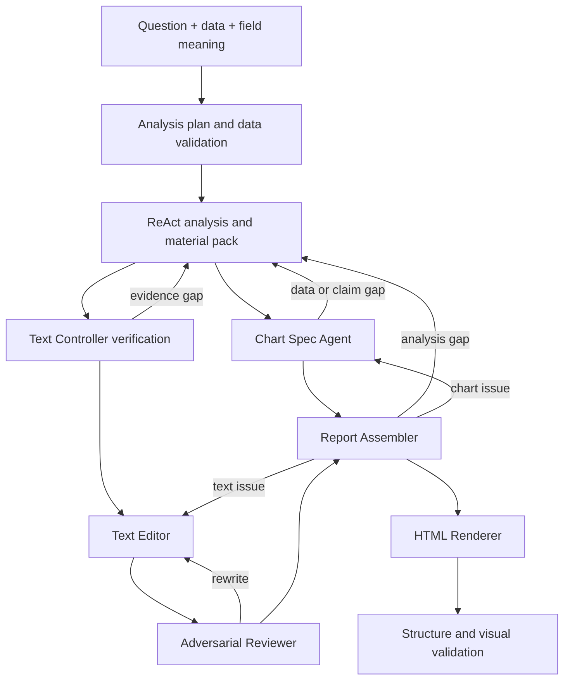

# Architecture

This skill is a report-production protocol, not a standalone model runtime.

## Core boundaries

| Component | Responsibility |
|---|---|
| `SKILL.md` | Stable workflow, gates, and delivery contract |
| `experience/` | Generic cross-case analysis and writing rules |
| `cases/<case-id>/` | Optional business semantics, thresholds, and boundaries |
| `agents/chart-spec-agent/` | Claim-bound chart specification and chart-side backfill opinion |
| `agents/report-text-controller/` | Unit decomposition, verification, backfill, answer-state control, and summary synthesis |
| `agents/report-text-editor/` | Temperature-0 wording for one verified unit |
| `agents/report-text-adversarial-reviewer/` | Independent evidence, logic, tone, usefulness, and line-fit review |
| `agents/report-assembler/` | Text-chart arbitration, route-back decision, and assembly handoff |
| `agents/html-report-renderer/` | Exact rendering of approved text and chart contracts |
| `styles/` | Separate style selection and color authority |
| `harness/` | Deterministic validation only |

The skill must not contain provider SDK clients, model names, API keys, network calls, or hidden execution runtimes.

## Workflow

Chart and text Agents run as separate roles but share the same verified report unit. They may emphasize different evidence, but they must support a compatible page-level claim.

## Layer rules

- The analysis layer owns calculations, evidence, business interpretation, and backfill.
- The chart Agent selects the visual form, required series, annotations, emphasis, and visual checks. It never recalculates data or writes report prose.
- The text layer writes complete reader-facing sentences from verified evidence. Internal evidence labels and verification chains are never rendered.
- The Assembler resolves text-chart relationships and controls all route-back decisions. It does not invent analysis, prose, or chart semantics.
- The renderer copies approved strings and chart specs. It may not strengthen, shorten, or add analytical claims.
- The format contract, selected style, and color system remain separate authorities.

## Validation gates

| Gate | Script |
|---|---|
| Plan | `harness/plan_validator.py` |
| Data | `harness/data_validator.py` |
| Agent runtime | `harness/agent_runtime_validator.py` |
| Analysis material | `harness/test_material_pack_contract.py` |
| Chart specification | `harness/chart_spec_validator.py` |
| Report text | `harness/report_text_validator.py` |
| Assembly | `harness/report_assembly_validator.py` |
| Final output | `harness/output_validator.py` |

Every failure must return to the role that owns the problem. Rendering may not hide an analytical, textual, or chart-contract failure.
