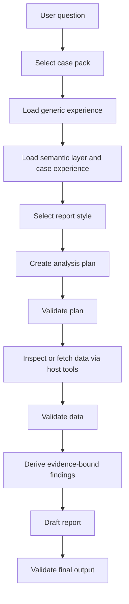

# Architecture

This skill is a report-production protocol, not a standalone model runtime.

## Boundaries

| Component | Responsibility |
|---|---|
| Codex | Reasoning, planning, writing, and user interaction |
| `SKILL.md` | Stable workflow and delivery contract |
| `experience/` | Generic cross-case reporting rules |
| `cases/<case-id>/semantic_layer.yaml` | Field meanings, grain, units, aliases, and analysis boundaries |
| `cases/<case-id>/experience/` | Case-specific thresholds, priority rules, and good examples |
| `styles/<style-id>/` | Page design tokens, layout, components, chart/table treatment, and global prompt |
| `harness/` | Deterministic structure validation |

The skill must not contain provider SDK clients, model names, API keys, network calls, or hidden execution runtimes.

## Workflow

## Layer Rules

Generic rules answer: "What makes a report reliable?"

Case semantic layer answers: "What do these columns mean?"

Case experience answers: "What thresholds and patterns matter in this business context?"

Style pack answers: "How should this report look and be arranged on the page?"

Style packs are referenceable design systems, not rendering engines. They can store design tokens, global prompts, and static HTML samples, but they must not contain API clients, live model calls, external CDN dependencies, or case-specific metric semantics.

Report findings answer: "What does this data support, and where does the evidence stop?"

## Validation Gates

| Gate | Script | Pass Standard |
|---|---|---|
| Plan | `harness/plan_validator.py` | Required plan fields exist; step is allowed by schema; stop threshold is not below default materiality |
| Data | `harness/data_validator.py` | Required data fields exist; rows are list-like; numeric rate fields stay in a reasonable range |
| Output | `harness/output_validator.py` | Summary and findings exist; findings have `data_source`; data gaps are structured |

## Report Shape

The final report can be Markdown or structured JSON, but it should preserve:

1. Executive summary.
2. Prioritized findings.
3. Evidence references.
4. Inference boundaries.
5. Data gaps.
6. Next steps.
7. Optional chart instructions.
