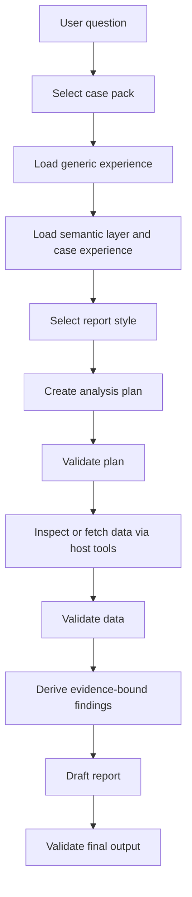

# Architecture

This skill is a report-production protocol, not a standalone model runtime.

## Boundaries

| Component | Responsibility |
|---|---|
| Codex | Reasoning, planning, writing, and user interaction |
| `SKILL.md` | Stable workflow and delivery contract |
| `experience/` | Generic cross-case reporting rules |
| `cases/<case-id>/semantic_layer.yaml` | Field meanings, grain, units, aliases, and analysis boundaries |
| `cases/<case-id>/experience/` | Case-specific thresholds, priority rules, and good examples |
| `styles/<style-id>/` | Page design tokens, layout, components, chart/table treatment, and global prompt |
| `harness/` | Deterministic structure validation |
| `D:\知识库\skills\data-report-presentation-planner` | Sibling understanding layer for Deck Outline v0.5, detailed outline, human approval, evidence grammar, candidate modes, semantic layout intent, Planner-owned Deck theme and subtitle/chart color roles, storyboard, and page contracts |
| `D:\知识库\skills\data-report-ppt-author` | Sibling cost-bounded authoring layer for isolated page packets, Page Visual Designer plans and SVG blueprints, conditional Chart Design UI, deterministic design gate with sampled/risk-triggered Judge, one page-scoped PPT Implementer, rendered-slide Judge, and page handoff |
| `D:\知识库\skills\data-report-pptx-renderer` | Sibling Compiler/SDK for native PowerPoint objects, package checks, deterministic QA, and legacy fixed-layout fallback |

The skill must not contain provider SDK clients, model names, API keys, network calls, or hidden execution runtimes.

## Workflow

## Layer Rules

Generic rules answer: "What makes a report reliable?"

Case semantic layer answers: "What do these columns mean?"

Case experience answers: "What thresholds and patterns matter in this business context?"

Style pack answers: "How should this report look and be arranged on the page?"

Style packs are referenceable design systems, not rendering engines. They can store design tokens, global prompts, and static HTML samples, but they must not contain API clients, live model calls, external CDN dependencies, or case-specific metric semantics.

PPTX generation follows the same rule. This skill owns report semantics and the rich analysis material pack. The sibling `data-report-presentation-planner` owns presentation reasoning, the human-approved story, the Deck theme, and semantic subtitle/chart color assignments, but stops before final geometry and emits page-bounded contexts. The sibling `data-report-ppt-author` resolves that color contract into Deck visual direction and starts every page role from an isolated task packet. Standard pages use one Page Visual Designer, one resumed PPT Implementer context, deterministic gates, and one bounded rendered-slide Judge. Chart Design UI and page-design Judge are conditional. The PPT Implementer cannot author text colors. The sibling `data-report-pptx-renderer` owns controlled PowerPoint helpers, compilation, package checks, deterministic QA, and the legacy fixed-layout fallback.

The downstream visual route remains evidence-dependent:

- quantitative evidence -> native editable PowerPoint chart;
- simple process or relationship -> native editable PowerPoint shapes;
- low-text explanatory scene, comparison, or conceptual mechanism -> generated `illustration_png` in an Author-locked image container.

SVG is used only as a reviewable blueprint that locks geometry and visual relationships before source authoring; it must never enter the final PPTX. AI illustrations are non-editable internally but must remain independently replaceable and regenerable. They may not contain the full slide, dense labels, or replace a quantitative chart that should retain editable data.

For new dense-report and PPT-bound runs, `analysis_material_pack` v0.3 is the handoff boundary:

```mermaid
flowchart LR
  A["Analysis goal"] --> B["Value-driven exploration"]
  B --> C["Decision-ready synthesis<br/>provisional finding + claim review"]
  C --> D["Material pack v0.3<br/>reviewed findings + visual evidence briefs"]
  D --> E["Deck Architect<br/>focus / merge / drop / backfill"]
  E --> F["Human-approved outline v0.5<br/>story + layout intent + semantic color plan"]
  F --> G["PPT Director<br/>resolve theme + SVG style references"]
  G --> H["Isolated Page Visual Designer<br/>slide plan + locked color bindings + chart specs + SVG blueprint"]
  H --> I["Harness gate<br/>Judge only for representative or risk pages"]
  I --> J["One page-scoped PPT Implementer<br/>component build + resumed assembly"]
  J --> K["PPTX Compiler/SDK<br/>editable objects"]
  K --> L["Deterministic QA + rendered-slide Judge"]
  L --> M["Locked pages + editable Deck"]
```

## Cost-Control Architecture

The default route reduces repeated model work while preserving analysis depth,
editability, deterministic QA, and rendered visual review.

| Layer | Model policy | Deterministic work |
| --- | --- | --- |
| Analysis | One primary context; no subagent per branch | Source profiling, calculations, evidence extraction, validation |
| Planner | One outline context; one consolidated backfill at most | Schema validation, approval hash, storyboard compilation, page slicing |
| Visual direction | Reuse by hash; Director only on cache miss | Reference/hash validation |
| Standard page | Designer + one resumed Implementer context + rendered Judge | Component measurement, composition gate, PPTX QA |
| Complex page | Add Chart UI and/or design Judge only with a recorded trigger | Same hard gates |
| Deck | One final contact-sheet Judge | Merge, package, editability, continuity checks |

New authoring runs target three model calls per standard page and allow one
responsibility-scoped revision. A page hard ceiling of six calls, a token budget
per role, or any parent-context inheritance breach stops automatic work and
returns `human_required`. See
`D:\知识库\skills\data-report-ppt-author\references\cost_control_contract.md`.

Analysis depth is not a slide-planning decision. The analysis Agent records why each branch continues or stops without a fixed depth or branch count, reviews provisional findings, and resolves weak wording before handoff. The Deck Architect receives decision-ready findings and cannot recompute analysis or manufacture missing business meaning; it may make one consolidated supplemental evidence request, after which remaining gaps require a human decision.

Report findings answer: "What does this data support, why does it matter, what decision should it inform, and where does the evidence stop?"

## Validation Gates

| Gate | Script | Pass Standard |
|---|---|---|
| Plan | `harness/plan_validator.py` | Required plan fields exist; step is allowed by schema; stop threshold is not below default materiality |
| Data | `harness/data_validator.py` | Required data fields exist; rows are list-like; numeric rate fields stay in a reasonable range |
| Output | `harness/output_validator.py` | Summary and findings exist; findings have `data_source`; data gaps are structured; v0.3 material packs have decision-ready findings, complete claim reviews, finding-bound chart briefs, evidence, and branch-decision contracts |

## Report Shape

The final report can be Markdown or structured JSON, but it should preserve:

1. Executive summary.
2. Prioritized findings.
3. Evidence references.
4. Inference boundaries.
5. Data gaps.
6. Next steps.
7. Optional chart instructions.
