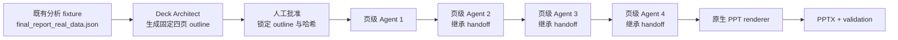
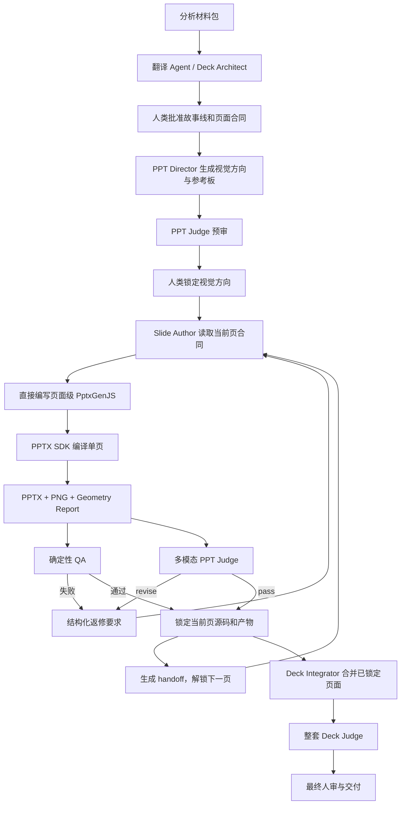

# 数据分析到可编辑 PPT Deck 工作流重设计报告

## 1. 元数据与结论
| 字段 | 内容 |
| --- | --- |
| 文档版本 | v1.0 |
| 日期 | 2026-07-13 |
| 角色 | 产品经理 |
| 状态 | 三项产品决策已确认；第一轮契约、门禁与回归实现已完成 |
| 适用范围 | `data-analysis-report-agent`、Deck Architect、页级 Agent、`data-report-pptx-renderer` 与 QA 的协作链路 |
| 事实基线 | 2026-07-12 销售额测试审计；本次复用 `final_report_real_data.json`，`recomputed=false` |
| 不适用范围 | 固定业务模板、模型隐藏思维链导出、当前阶段平台化 |
**一句结论：** 新流程应先由分析 Agent 围绕目标生成有意过量且可审计的材料包，再由 Deck Architect 按页面组合价值执行 `focus / merge / drop / backfill`，经人审锁定后交给顺序页级 Agent 与 renderer，从而让页数和密度由证据关系自然生成，而不是由固定四页、固定层级或固定模块数预先决定。

## 2. 用户真实问题与成功定义
### 2.1 用户真实问题
用户要解决的不是“怎样把四页 PPT 填得更满”，而是“怎样把分析结果稳定转成真实、紧凑、可编辑、可审计的管理汇报”。
当前链路已经证明能生成可打开、可编辑、可验证的 PPTX，但不能稳定保证：
- 上游分析素材对汇报目标足够饱和；
- 相关薄结论会被合并，而不是机械拆成多页；
- 低价值或证据不足的结论会被舍弃；
- 关键证据缺口会被一次性汇总退回分析层；
- 每页的信息之间形成解释关系，而不是只堆图、卡片和说明文字；
- 各角色都只在自己的事实权限内工作。
### 2.2 成功定义
成功不是固定生成更多页、更多图或更多模块，而是同时满足以下结果：
1. 分析 Agent 对目标问题进行价值驱动的饱和式探索，并记录每个分支继续或停止的理由。
2. 分析输出有意过量，完整提供已验证结论、候选解释、证据、候选图、边界、缺口和分支日志。
3. Deck Architect 不重算、不创造事实，能对素材执行聚焦、合并、舍弃和一次性补证请求。
4. Deck 页数由故事线与证据关系自然生成，不由四页、三层下钻或某种 archetype 数量预设。
5. 每页只有一个明确管理问题，但可包含多个互相解释的证据模块。
6. 页级 Agent 保持一页一 Agent、顺序执行和 handoff 继承，不新增顶层分析结论。
7. renderer 保持原生可编辑 chart 主链路，并允许可编辑 shapes 或经明确选择的 PNG 示意图分支。
8. 最终交付可追溯、可验证、可回退，且只输出显式决策日志，不输出隐藏思维链。

## 3. 过去流程与失败机制
### 3.1 过去流程

### 3.2 各节点实际职责
| 节点 | 实际职责 | 本次表现 |
| --- | --- | --- |
| 既有分析 fixture | 提供结论、证据表和候选图 | 有 7 个 evidence table，但 `chart_inventory` 仅 5 个候选图；本次未实时重跑分析 Agent |
| Deck Architect | 把分析素材转成全局故事线和四页 outline | 保持事实边界，但固定拆页；未对薄页做组合价值判断 |
| 人工批准 | 审核并锁定四页结构 | 锁定后页级 Agent 只能在批准边界内执行 |
| 4 个页级 Agent | 分别完成一页，顺序继承上一页 handoff | 独立执行真实生效，但均被禁止重算分析和新增顶层结论 |
| Renderer | 把页面对象确定性渲染为可编辑 PPTX | 输出 4 页、5 个原生 chart、0 图片；不能凭空补充分析素材 |
| Validation | 验证页数、对象、可编辑性与输出状态 | 能验证渲染结果，不能替代内容价值判断 |
### 3.3 为什么表面正确但实际失败
旧流程的每个节点都“按合同完成了任务”，但局部合规没有形成整体产品成功：
| 表面正确 | 实际失败 |
| --- | --- |
| 分析 JSON 有结论和证据 | driver tree 只到 `furniture -> subcategory / region / segment` 一层并列切片，且 province、ship 未进入候选图清单 |
| Deck Architect 生成了完整四页 outline | 把三个薄切片分别固化成页，没有先判断合并、舍弃或补证价值 |
| 人工批准形成稳定边界 | 人审批准的是一个已经偏薄的结构，后续只能忠实执行 |
| 每页由不同 Agent 顺序完成 | `must_not_recompute_analysis=true` 与 `must_not_add_top_level_claim=true` 使页级 Agent 无权弥补上游缺口 |
| Renderer 输出了原生可编辑图表 | Renderer 只能表达已有材料，无法创造新事实或新解释 |
| 第 1 页效果较强 | 第 1 页的双图、四个 KPI 与口径边界构成了关系密度；它是质量标杆，不是固定业务模板 |
因此，根因是“分析素材薄 + Deck Architect 固定拆页且缺少组合价值判断 + 页级 Agent 权限正确受限”的联合作用，不是 renderer 一项。
同时必须保留事实边界：本次 `recomputed=false`，不能据此断言实时分析 Agent 曾主动停止下钻；只能证明当前 fixture 和契约交付给下游的素材不足。

## 4. 未来流程设计

```mermaid
flowchart LR
  A["分析目标与口径"] --> B["分析 Agent<br/>目标驱动的饱和式探索"]
  B --> C["analysis_material_pack<br/>+ analysis_decision_log"]
  C --> D["Deck Architect<br/>focus / merge / drop / backfill"]
  D -->|"关键且高补证价值<br/>一次性汇总请求"| B
  D --> E["deck_outline<br/>+ composition_decision_log"]
  E --> F["人类审阅与锁定"]
  F --> G1["页级 Agent 1<br/>page_context"]
  G1 -->|"slide_handoff"| G2["页级 Agent 2"]
  G2 -->|"顺序继承"| GN["页级 Agent N"]
  GN --> H["Renderer"]
  H --> H1["原生 chart + 可编辑 shapes"]
  H --> H2["显式选择的 PNG 示意图"]
  H1 --> I["QA + render_validation"]
  H2 --> I
  I --> J["PPTX 交付或回退到责任节点"]
```

### 4.1 分析探索
- 分析 Agent 负责事实、数据、结论和围绕目标的饱和式探索。
- 通常检查约 3 层可作为搜索预算启发，但绝不要求每个分支固定输出 3 层。
- 每个分支按价值、证据质量、影响量和边际解释力选择 `continue` 或 `stop`。
- 停止必须有显式理由，例如影响有限、证据不足、与目标弱相关、边际解释力下降或已被更强解释覆盖。
- 分析输出面向“可选择材料池”，不面向预设 PPT 页数裁剪。
### 4.2 材料包
- `analysis_material_pack` 同时保存可直接使用的事实和仍需谨慎处理的候选解释。
- 已验证、候选、边界、缺口必须分层，避免下游把假设误写成结论。
- 所有 evidence table 和 chart candidate 均应被登记；未选用不等于遗漏，必须有状态或理由。
### 4.3 Deck Architect 组合
- `focus`：一个结论独立回答关键管理问题，允许简洁但必须完整。
- `merge`：多个相关薄素材合并后能共同回答一个问题，优先于机械拆页。
- `drop`：弱相关、重复、证据不足或没有新增解释价值的素材不进入 Deck。
- `backfill`：仅当缺口对故事线关键且预期补证价值高时触发，并一次性汇总返回分析 Agent。
- Deck Architect 只组合和解释材料角色，不重算指标、不下钻原始数据、不创造事实。
### 4.4 人审、页级执行与渲染
- 人审对象从“页标题列表”升级为“故事线、组合决策、证据覆盖、缺口处置和页级合同”。
- 一页一 subagent 继续保留，并按页序继承全局故事线和上一页 handoff。
- 页级 Agent 只做页面叙事、信息层级和呈现决策，不新增顶层事实。
- 原生可编辑 chart 是数据表达主链路，可叠加可编辑 shapes 完成标注、贡献模块和解释关系。
- 纯结论、流程、对比或概念解释场景，可由 Deck Architect 显式选择 PNG 示意图分支，并记录不可编辑影响。
- QA 同时检查事实追溯、语义关系密度、版式、可编辑性和分支使用理由。

## 5. 新旧流程对照
| 维度 | 旧流程 | 新流程 |
| --- | --- | --- |
| 分析深度 | fixture 提供到哪里就用到哪里 | 按目标、价值和边际解释力动态探索 |
| 三层下钻 | 容易被理解为固定深度 | 仅作为搜索预算启发，不是产物配额 |
| 分析输出 | 偏向最终结论和有限候选图 | 有意过量的材料包与分支日志 |
| 证据覆盖 | evidence table 可未进入 `chart_inventory` | 每份证据都有登记、状态与处置理由 |
| Deck 规划 | 先固定拆页再填内容 | 先判断 `focus / merge / drop / backfill` 再生成页 |
| 页数 | 预设四页 | 由故事线与有效证据自然生成 |
| 密度 | 易被模块数、图数定义 | 由信息之间的解释关系定义 |
| 补证 | 未形成稳定入口 | 关键缺口一次性汇总退回分析层 |
| 页级 Agent | 顺序执行，但合同偏薄 | 顺序执行并继承更完整的全局与前页上下文 |
| Renderer | 原生对象渲染 | 继续原生渲染，并支持 shapes 叠加与显式 PNG 分支 |
| 日志 | 以操作日志和文件链为主 | 增加四类显式决策日志与 render validation |
| 回退 | 容易把问题归到 renderer | 按事实、组合、页面、渲染责任节点定向回退 |

## 6. 角色边界
| 角色 | 必须负责 | 明确禁止 | 主要输出 |
| --- | --- | --- | --- |
| 分析 Agent | 事实、计算、结论、候选解释、目标驱动探索、证据边界与缺口 | 按预设页数裁剪分析；为填页强行下钻 | `analysis_material_pack`、`analysis_decision_log` |
| Deck Architect | 故事线、素材角色解释、聚焦/合并/舍弃/补证、页级合同 | 重算数据、创造事实、把薄素材机械拆页 | `deck_outline`、`composition_decision_log` |
| 页级 Agent | 单页叙事、布局意图、证据编排、显式页面决策、顺序 handoff | 重算分析、新增顶层结论、越过批准合同 | `page_context` 消费结果、`slide_decision_log`、`slide_handoff` |
| Renderer | 原生 PPT 对象、可编辑 chart、shapes、PNG 插入、确定性渲染 | 推断故事线、补分析、替换未经批准的结论 | PPTX、`render_validation` |
| 人类 | 审核目标、故事线、补证价值、页面边界、视觉取舍与最终交付 | 用模糊批准替代关键取舍 | approval、锁定版本、回退决定 |
所有角色只输出可审计的显式决策及其依据，不保存或导出模型隐藏思维链。

## 7. 人类可读开放契约
以下字段只定义跨角色协作骨架，不绑定销售额、利润率或任何固定业务场景。
### 7.1 `analysis_material_pack`
```yaml
contract_version: string
analysis_goal: {question, audience, decision_to_support, time_scope}
metric_context: [{metric_id, definition, unit, grain, filters, source_refs}]
validated_findings: [{finding_id, statement, importance, confidence, evidence_refs, boundary_refs}]
candidate_explanations: [{candidate_id, parent_id, statement, status, expected_value, evidence_refs}]
evidence_inventory: [{evidence_id, type, subject, grain, data_ref, quality, source_refs, availability}]
chart_candidates: [{chart_id, question_answered, evidence_refs, recommended_form, editability_need}]
boundaries: [{boundary_id, scope, limitation, affected_material_refs}]
gaps: [{gap_id, question, importance, expected_value, feasibility, related_refs}]
analysis_decision_log_ref: string
```
### 7.2 `analysis_decision_log`
```yaml
entries:
  - {branch_id, parent_id, question, decision: continue|stop, reason, evidence_refs,
     impact_estimate, confidence, marginal_explanatory_value, next_probe, timestamp}
```
### 7.3 `deck_outline`
```yaml
deck_goal: {audience, decision_to_support, narrative_question}
source_material_pack_ref: string
storyline: [{sequence, purpose, question, transition}]
slides:
  - {slide_id, page_question, approved_claim_refs, material_refs, composition_decision_ref,
     evidence_boundary_refs, visual_intent, render_mode, expected_handoff}
dropped_material_refs: [string]
backfill_request_ref: string|null
approval: {status, reviewer, locked_version, locked_at}
```
### 7.4 `composition_decision_log`
```yaml
entries:
  - {decision_id, material_refs, action: focus|merge|drop|backfill, utility_judgement,
     story_role, coverage_effect, evidence_gap_refs, reason, human_review_required}
backfill_request: {request_mode: single_batch, gap_refs: [string], return_contract}|null
```
### 7.5 `page_context` 与 `slide_handoff`
```yaml
page_context:
  {slide_id, deck_goal_ref, storyline_position, page_question, approved_claim_refs,
   material_refs, boundary_refs, composition_decision_ref, previous_handoff_ref,
   must_not_recompute_analysis, must_not_add_top_level_claim}
slide_handoff:
  {slide_id, delivered_claim_refs, used_material_refs, semantic_transition,
   continuity_requirements, unresolved_presentation_issues, next_slide_id}
```
### 7.6 `slide_decision_log`
```yaml
entries:
  - {slide_id, decision_type, options_considered, selected_option, explicit_reason,
     material_refs, effect_on_handoff, requires_reapproval}
```
### 7.7 `render_validation`
```yaml
artifact: {pptx_path, deck_version, page_count, generated_at}
editability: {native_text, native_tables, native_charts, editable_shapes, png_images, fallbacks}
traceability: [{slide_id, claim_refs, evidence_refs, rendered_object_refs}]
layout_checks: {overlap, overflow, clipping, empty_regions, status}
content_checks: {unapproved_claims, missing_sources, boundary_disclosure, status}
branch_checks: [{slide_id, render_mode, selection_reason, editability_impact}]
qa_result: {status: pass|fail, blockers, warnings, rollback_target}
```

## 8. 销售额下降案例映射
### 8.1 旧四页结构
| 页 | 旧页面问题 | 主要素材 | 审计结果 |
| --- | --- | --- | --- |
| 1 | 总销售额发生了什么 | 月度销售额、类别差额、4 个 KPI、口径边界 | 当前视觉与信息关系最强，作为质量标杆 |
| 2 | 家具由哪些子类别拖累 | 家具子类别差额 | 一张图加少量说明，独立成页偏薄 |
| 3 | 家具由哪些区域拖累 | 家具区域差额 | 只有区域排名，没有区域内部解释 |
| 4 | 家具由哪些客群拖累 | 家具客群差额 | 只有客群排名和边界，没有客群内部解释 |
原始报告另有 province 和 ship 两张 evidence table，但它们分别是“家具整体按省份”和“家具整体按装运模式”，不能直接冒充“华北内部省份”或“消费者内部装运模式”的下钻证据。
### 8.2 未来可能生成的结构
一种合理结果是自然合并为两页：
| 页 | 管理问题 | 组合方式 |
| --- | --- | --- |
| 1 总览 | 销售额下降有多大，主要由什么类别贡献 | 保留当前第 1 页的趋势、类别差额、KPI 与口径边界 |
| 2 家具下降结构 | 家具下降由哪些已验证切片共同构成，哪些仍只是边界或候选方向 | 合并子类别、区域、客群的互补证据；明确 province、ship 的适用粒度和未覆盖关系 |
这不是固定“两页模板”。如果实时分析发现某个分支具有高影响、高置信度和新增解释价值，例如在严格父级筛选下形成完整证据链，该分支可以独立成页；其他弱分支则合并或舍弃。
因此，未来结果也可能是 2 页、3 页或更多页，但每一页都必须由可证明的组合价值产生。

## 9. 设计理由
| 设计目标 | 为什么这样设计 |
| --- | --- |
| 真实性 | 把已验证结论、候选解释和证据边界分开，避免下游把不足素材包装成确定事实 |
| 责任隔离 | 分析负责事实，Architect 负责组合，页级 Agent 负责表达，renderer 负责对象生成 |
| 模型能力 | 让模型在最擅长的开放判断范围内工作，同时用合同限制越权重算和事实创造 |
| 语义密度 | 评估证据之间是否共同解释管理问题，而不是检查固定图数或模块数 |
| 跨场景 | 开放字段围绕问题、证据、边界和决策，不绑定某一种经营分析模板 |
| 可审计 | 四类显式决策日志记录继续、停止、组合、页面和渲染选择 |
| 可回退 | QA 失败可回到对应责任节点，不必一律重跑全部流程或归咎 renderer |

## 10. 分阶段开发计划
| 阶段 | 目标 | 主要产物 | 通过标准 |
| --- | --- | --- | --- |
| 0. 契约确认 | 锁定角色边界、开放字段与人审门 | 本报告确认版 | 主 Agent 对最多 3 个决策点给出结论 |
| 1. 分析材料包 | 输出过量材料、完整 inventory 与分支日志 | `analysis_material_pack`、`analysis_decision_log` | 每个探索分支有 continue/stop 与理由；所有证据有状态 |
| 2. 组合决策 | 实现 focus/merge/drop/backfill 和一次性补证 | `deck_outline`、`composition_decision_log` | 不重算事实；薄素材优先合并；补证请求最多一次汇总 |
| 3. 页级协作 | 扩展 page context、顺序 handoff 和显式页级日志 | `page_context`、`slide_handoff`、`slide_decision_log` | 一页一 Agent；跨页连续；无新增顶层结论 |
| 4. 渲染与 QA | 保留原生图表，增加 shapes 叠加与显式 PNG 分支审计 | PPTX、`render_validation` | 可编辑对象、图片、fallback、事实追溯和版式均可查 |
| 5. 场景回归 | 用销售额下降案例比较旧四页与自然生成结构 | 对照 PPTX、validation、审计记录 | 页数不预设；内容价值高于旧四页；第 1 页质量不退化 |
### 10.1 代码影响矩阵
当前仅完成产品设计，未读取实现源码；以下实现位置统一标记为“待定位模块”，不编造文件名。
| 文件/模块 | 目的 | 上下游影响 | 验证方式 | 回退方式 |
| --- | --- | --- | --- | --- |
| 分析探索与材料包输出（待定位模块） | 增加材料 inventory、候选解释和分支日志 | 上游数据口径；下游 Deck Architect 输入 | fixture 契约校验 + 分支日志覆盖测试 | 保留旧输出适配层，回退新增字段消费 |
| Deck Architect 组合决策（待定位模块） | 增加 focus/merge/drop/backfill | 影响大纲、人审与补证循环 | 组合决策单测 + 销售案例回归 | 切回旧 outline 入口但标记 legacy |
| 人审锁定与版本管理（待定位模块） | 锁定故事线、组合决策和证据覆盖 | 影响页级 Agent 可用上下文 | 哈希/版本一致性检查 | 回退到上一已批准版本 |
| 页级 Agent 上下文与 handoff（待定位模块） | 增加完整 page context 与显式日志 | 影响逐页顺序执行和跨页连续性 | 逐页输入输出合同验证 | 回退新增可选字段，不取消一页一 Agent |
| Renderer 输入适配（待定位模块） | 接收 render mode、shapes 与 PNG 分支 | 影响 PPTX 对象和可编辑性 | 旧样例回归 + 对象级 validation | 保留原生 chart 旧路径 |
| QA/validator（待定位模块） | 增加事实追溯、关系密度和分支审计 | 影响最终交付门禁 | pass/fail fixture + PPTX 包级检查 | 仅回退新增非阻断规则 |
## 11. 验收标准
1. 测试记录明确标注分析是否实时重算；复用 fixture 时必须保留 `recomputed=false`。
2. `analysis_material_pack` 区分已验证结论、候选解释、边界和缺口。
3. evidence inventory 与 chart candidates 均完整登记；未使用项有明确处置理由。
4. 每个分析分支记录 `continue / stop`、理由、证据、影响量、置信度和边际解释力。
5. Deck Architect 对每组候选素材记录 `focus / merge / drop / backfill`。
6. `backfill` 仅用于故事线关键且预期补证价值高的缺口，并以 `single_batch` 一次性汇总。
7. Deck Architect、页级 Agent 和 renderer 均未产生未经分析材料支持的新事实。
8. 页数由已批准故事线自然生成，验收规则不包含固定页数、固定图数或固定模块数。
9. 每页的主张、证据、边界和渲染对象可追溯。
10. 一页一 Agent、顺序执行、上一页 handoff 继承继续生效。
11. 页级 Agent 的 `must_not_recompute_analysis` 与 `must_not_add_top_level_claim` 继续生效。
12. 数据图优先为原生可编辑 chart；辅助 shapes 可编辑；PNG 分支有显式理由和影响记录。
13. QA 不只数对象，还检查信息是否共同回答页面问题、是否存在重复和无角色元素。
14. PPTX 可打开，无阻断级重叠、溢出、裁切、来源缺失或未批准结论。
15. 所有决策日志均为显式结论和依据，不含模型隐藏思维链。
## 12. 风险与非目标
### 12.1 主要风险
| 风险 | 表现 | 控制措施 |
| --- | --- | --- |
| 分析探索失控 | 为追求“饱和”无限下钻 | 用目标相关性、影响量、证据质量和边际解释力作为停止门 |
| 材料包噪声过大 | 候选过多导致 Architect 难以选择 | 强制状态、优先级、置信度、边界和 expected value |
| Architect 越权 | 在组合时重新计算或制造解释 | 只允许引用 material refs；新增事实即阻断 |
| backfill 循环 | 多轮往返拖慢交付 | 仅允许一次 `single_batch` 汇总；再次缺口交人类取舍 |
| PNG 滥用 | 视觉提升但可编辑性下降 | 仅限显式场景选择，并在 validation 中披露影响 |
| 密度再次数量化 | 又退回固定 6–12 模块等规则 | 以页面问题覆盖、关系完整性和重复度验收 |
| 合同过拟合销售案例 | 其他分析场景无法复用 | 字段只表达问题、证据、边界、决策和呈现，不写死业务实体 |
### 12.2 非目标
- 不要求每个分析分支固定输出 3 层。
- 不预设 Deck 必须是 2 页、4 页或其他固定页数。
- 不把第 1 页固化为固定业务模板；它只作为当前质量标杆。
- 不要求每页固定图数、卡片数、模块数或 archetype。
- 不允许 Deck Architect、页级 Agent 或 renderer 重新分析原始数据。
- 不导出模型隐藏思维链，只保留显式、可审查的决策记录。
- 不在本报告中确定具体实现文件，不修改代码、skill、样例或其他文档。
## 13. 与旧文档的关系
| 旧文档 | 继续有效 | 被本报告替代或降级的部分 |
| --- | --- | --- |
| `pptx-renderer-implementation-plan-20260627.md` | 独立 renderer skill、PptxGenJS 主链路、原生可编辑对象、PPTX + validation、样例驱动与 fallback 透明继续有效 | “报告结构直接进入 deck JSON”的简化流程升级为材料包、组合、人审、页级 Agent、renderer、QA 的完整链路 |
| `pptx-template-level-report-plan-20260705.md` | 可编辑性、原生 chart 与 shapes 协同、正式汇报视觉、用户确认案例后再沉淀继续有效 | 固定 archetype、固定密度数量、默认模块配额、先定页面类型再填素材的假设由本报告替代；相关内容仅保留为案例参考 |
`native_chart`、可编辑 shapes 和必要的图片分支仍是技术表现手段，但不再反向决定分析深度、页面数量或故事线。
## 14. 用户决策状态
1. **已确认：补证往返次数。** 分析 Agent 完成首次分析后，如果 Deck Architect 发现关键材料缺失，应先把所有缺口整理成一张清单，一次性交给分析 Agent 补充。补充结果返回后，自动往返停止；仍有缺口时由人类决定注明边界、合并或删除相关页面、特批额外分析，或者终止本次 Deck。这项规则不限制首次分析深度，也不代表只能补一个问题。
2. **已确认：渲染优先级。** 默认采用“原生可编辑 chart + 可编辑 shapes”；PNG 仅由 Deck Architect 对纯结论、流程、对比等适合示意表达的场景显式选择。
3. **已确认：旧模板规则降级。** 旧模板文档中的固定 archetype、固定模块密度与固定拆页规则只作为案例参考，不再作为全局验收约束。

## 15. 第一轮实施状态（2026-07-13）

| 实施项 | 状态 | 已落地内容 |
| --- | --- | --- |
| 分析材料包 | 已完成 | `analysis_material_pack` v0.2、开放素材数组、证据库存、边界、缺口、`continue / stop` 分支日志和新旧兼容验证 |
| Deck Architect | 已完成 | Outline v0.2、素材全覆盖、`focus / merge / drop / backfill`、一次 `single_batch` 补证阻断和人类审查展示 |
| 页级 Agent 合同 | 已完成 | 完整 page context、组合决策、上一页 handoff、下一页 preview、显式 slide decision log 和 handoff validator |
| Renderer 全局规则 | 已完成 | 原生 chart + shapes 为默认；PNG 显式选择；固定 archetype 和模块数量降级为案例参考；renderer 禁止自行拆页或合并 |
| 自动回归 | 已完成 | 新材料包正向与 3 个负向门禁、3 个旧 Planner holdout、新两页合并 holdout、3 个 Skill 结构验证、真实 PPTX 冒烟输出 |

本轮尚未用真实数据重新运行完整分析 Agent 和新 Planner 生成新的验收 Deck。下一门禁是使用同一销售数据实时生成 v0.2 材料包，先让人审查材料和自然生成的大纲，再进入逐页 PPT 制作。

## 16. 真实运行复盘与第二轮质量方案（2026-07-16）

### 16.1 产品结论

本次真实运行证明“分析素材更丰富会提高最终信息密度”，因此不应回退过量素材策略，也不应把分析深度重新写死。当前结论分为三层：

1. **分析 Agent 暂无证据表明失控。** 本次共 5 轮、897.471 秒，输出 14 条已验证结论、24 条候选解释、27 份证据和 20 个候选图表；24 个分支中 16 个主动停止，只有 2 个进入第 3 层。
2. **成本仍不可审计。** 旧日志没有逐阶段耗时、主模型调用、Token、重试、每轮新增证据或决策影响，因此只能判断探索结构受控，不能准确判断资源是否浪费。
3. **当前 PPT 事实和可编辑性通过，演示质量不通过。** 8 页、14 个原生图表、1 个原生表格和 0 个 fallback 只能证明对象可编辑，不能证明标注、排版和投屏可读性合格。

### 16.2 当前链路的复杂度证据

| 层级 | 已验证事实 | 判断 |
| --- | --- | --- |
| 分析 | 5 轮；深度分布为 11 个一级、11 个二级、2 个三级；8 个 continue、16 个 stop | 丰富但未无限下钻，维持开放深度 |
| Planner | 55 份素材中 48 份进入主 Deck，`focus=0`；8 组 merge、3 组 drop | 处置不等于压缩，主 Deck 与证据库角色没有分开 |
| 页面合同 | 8 页共 55 个内容节点，全部标为 `must_use` | 优先级语义失效，页级 Agent 无法真正舍弃或降级素材 |
| 页级执行 | 8 个独立页级 Agent，7 页采用 `dual_chart_diagnosis` | 一页一 Agent 已执行，但同质构图与重复上下文放大成本 |
| Renderer | validation 为 `warnings=[]`，截图仍有溢出、悬空标注和错位 | 当前 PASS 是对象级，不是视觉级 |

分析素材包继续作为“过量证据库”。Planner 必须新增 `main_deck / appendix / evidence_only` 三种素材去向；这不是压低信息密度，而是把决定管理判断的证据留在主 Deck，把审计素材和低边际价值分支保留在可追溯的附录或证据库。

### 16.3 已落地的分析运行日志

本轮已经把缺失的运行可观测性补进分析 skill：

- `references/analysis_run_observability_contract.md`：定义逐阶段事件流、汇总日志、用量、产出增量和边际价值字段；
- `analysis-run-events.jsonl`：未来运行从开始时追加事件，不允许结束后补造实时阶段耗时；
- `analysis-run-log.json`：汇总阶段耗时、行数、证据/结论/图表/缺口增量、分支数、模型和 subagent 调用；
- `harness/run_observability_validator.py`：对实时与历史回填模式做确定性校验；
- `harness/test_run_observability_contract.py`：覆盖实时正例、历史诚实回填和 3 个负向门禁。

两个连续零产出阶段、重复 probe 或耗时增长但决策不变只产生 review warning，不自动终止分析。继续分析必须写明显式理由，但仍不设置固定层级、分支数、图表数或页数。

### 16.4 PPT 视觉根因

| 表现 | 代码级根因 | 影响范围 |
| --- | --- | --- |
| KPI 的同比说明落在边框外 | `addMetricStrip` 的 delta 文本结束于 `y + 1.12`，`dual_chart_diagnosis` 只给容器 `h = 0.96` | 第 1-7 页系统性复现，不是单页问题 |
| 折线点与标注 leader 分离 | 原生类目轴按 `crossBetween=between` 布点，但 shape 锚点按 `index / (n - 1)` 估算；应显式区分 `between` 与 `on_tick` | 所有原生类目轴外部标注 |
| 标注遮住数据标签 | 碰撞检测只比较 annotation 之间，不知道原生 chart 的 data label bbox | 所有 chart + shape 混合页面 |
| 参考线标签、柱标签和注释重复 | Renderer 无“同一事实只编码一次”的互斥规则，且 `showValue` 当前固定为 true，没有执行 `label_policy` | 小图、窄图和含 benchmark 页面最明显 |
| 标题、KPI、图题和解释条不齐 | 各组件使用独立绝对坐标，没有共享 `PageGrid → Region → Component → ContentBox` 几何上下文 | 所有复杂布局 |
| 高密度页绕过 QA | `validateTemplateTextFit` 未覆盖 `dual_chart_diagnosis`；validation 主要统计对象和来源 | 7 个双图页面均可能 0 warning 带病通过 |
| 语义字段未消费 | 页面包声明 subtitle，但双图和表格渲染函数不消费，也不报错 | 信息被挤入主标题或静默丢失 |
| 用户改数据后外部标注不联动 | reference line 和 annotation 是独立 shape，不属于原生 chart 数据系列 | 只保证初始可编辑，不保证改数后自动重排 |

结论：需要全局规范，但规范必须约束几何、容器、字体底线、数据编码和验证，不得规定每页必须长成四 KPI + 双图、固定图数或固定 archetype。

### 16.5 第二轮实施范围

#### P0：先恢复正确性

1. 新增共享 `ChartGeometryResolver`，原生 chart 的 plot layout、类目轴语义和外部 shape 读取同一份 geometry manifest。
2. 修复 `between → (index + 0.5) / n` 与 `on_tick → index / (n - 1)` 的类目轴锚点逻辑。
3. 把 MetricStrip 纳入组件尺寸契约；子对象必须完全包含于父容器，当前布局高度不足时直接失败而不是溢出。
4. 让 `label_policy`、`axis_format` 和最小字号真正进入 renderer；同一数值不能同时显示普通数据标签、同值 annotation 和同值 reference label。
5. 高密度 QA 按内容触发：`metrics >= 3`、`charts >= 2` 或 `visual_mode = hybrid_dashboard` 任一命中即检查，不再依赖固定模板名。
6. Planner 恢复 `must_use` 语义：必须提供 `must_use_reason`；其余素材可进入 `supporting`、`appendix` 或 `evidence_only`。

#### P1：统一组件与可读性

1. 所有页面坐标从全局网格和区域派生，同组可见左轴误差不得超过 `0.04in`。
2. Chart module 固定包含 title lane、plot lane、annotation lane、unit 和 source zone；标注默认放在 plot 外的安全 lane。
3. 每个容器声明 `min_w`、`min_h`、padding 和 intrinsic height，禁止无限 shrink；低于角色最小字号时返回 Planner 压缩语义，不由 renderer 继续缩字。
4. 非空 `title / subtitle / takeaway / body / source` 必须 100% 消费或显式报错。
5. 页级上下文只携带当前页素材、必要来源、全局论点、上一页 handoff 和下一页目标，不再重复全部 55 份素材正文。

#### P2：视觉门与案例回归

1. 全量生产前只做两张代表样页：最高密度分析页和行动/表格页；记录截图哈希、审批人和修改意见。
2. 生成每页 geometry report，检查容器包含、bbox 重叠、锚点误差、字段消费和字体底线。
3. 以 1600×900 和 1366×768 两档真实截图做视觉回归；contact sheet 仅作为审查入口，不能自动等同于通过。
4. 回归夹具至少覆盖末端折线标注、柱图基准线、3/4 项 KPI、双行图题、正负柱和长解释条。
5. 只有上述门禁稳定后才增加新的模板案例；模板只作为案例库，不成为全局规则。

### 16.6 第二轮验收标准

| 门禁 | 通过标准 |
| --- | --- |
| 分析可复盘 | 新运行存在事件流与汇总；每阶段有耗时、产出增量和用量，未知值有原因 |
| 素材取舍 | 每份素材有去向；每个 `must_use` 有删除后会影响的主张、证据或必要边界 |
| 容器包含 | 子对象溢出为 0；文字与边框安全距不少于 `0.06in` |
| 锚点正确 | leader endpoint 与目标点或柱边距离不超过 `0.04in` |
| 网格对齐 | 同组边线或文本轴最大偏差不超过 `0.04in` |
| 重复编码 | 同一数据点的普通标签、annotation 与 reference label 不重复表达同一数值 |
| 字段消费 | 非空语义字段消费率 100%，未消费即阻断 |
| 可读性 | 默认按老板汇报/投屏模式验收：标题、正文、轴标签、数据标签和来源均不得低于角色底线 |
| 可编辑性 | 原生 chart 和内嵌工作簿保留；外部 shape 标注明确记录 `binding_mode` 及改数后不联动风险 |
| 视觉门 | 两张代表页先审；两档截图无重叠、裁切、溢出和悬空 leader 后才批量生产 |

### 16.7 明确不做

- 不新增压缩 Agent、密度 Agent 或更多视觉批评角色。
- 不重新运行当前分析数据；下一轮复用已经验证的材料包，先修 Planner 和 Renderer。
- 不设置固定三层下钻、固定页数、固定图表数或固定模块数。
- 不先建设复杂的主观视觉评分模型；第一阶段先做几何、字号、重复编码和真实截图人审。
- 不继续为当前 PPT 单点调整坐标，所有视觉修复必须进入公共规则、renderer 实现和回归夹具。

## 17. PPT 原生撰写 Agent 改造计划（已批准并进入开发，2026-07-16）

### 17.1 一句话方案

不再让页级 Agent 只选择模板、再由固定 Renderer 决定最终页面。新增独立的 `data-report-ppt-author`：大模型直接为每一页编写可编辑 PowerPoint 对象代码、查看实际预览并返修；现有 Renderer 降级为只负责编译、图表底层正确性和确定性校验的 PPTX SDK。

这次改造解决的是“最后一公里没有大模型设计权”，不是继续增加模板或提示词。

#### 最终产物硬边界

- 最终交付物始终是可编辑 `.pptx`，不是 PNG、HTML、SVG 或整页截图。
- 视觉参考图、`reference-board.png` 和逐页 `preview.png` 都只是中间审查材料，不是最终页面资产。
- `preview.png` 必须由当前页的真实 `.pptx` 渲染得到，仅供 Slide Author、Judge 和人类查看页面效果。
- Judge 的通过结论必须同时引用 `slide.pptx` 的 SHA-256 和由该 PPTX 生成的 preview SHA-256，禁止审查一张与最终 PPTX 无关的效果图。
- Slide Author 必须先生成原生 PowerPoint 对象，再从 PPTX 导出预览；不得先设计 PNG，再把 PNG 作为整页背景放进 PPT。
- 除用户明确批准的照片、Logo 或不可编辑辅助图片外，标题、正文、图表、表格、标注、流程和主要示意关系必须保留为原生可编辑对象。

### 17.2 为什么要改

当前链路表面上已经有“一页一个 Agent”，但实际过程是：

```text
页级 Agent 判断内容和布局类型
  -> 输出 layout_id、chart JSON 和文本
  -> 固定 Renderer 使用硬编码坐标重新完成页面
  -> Agent 没有看到最终对象，也不能根据真实预览调整实现
```

因此页级 Agent 的视觉思考只能停留在意图层，真正决定图表大小、文字框位置、标注坐标和页面节奏的仍是固定 Renderer。

小红书图文链路已经验证过相反路线：上游先锁定文案、结构和视觉方式，最终成图由 design-ui 大模型直接完成；HTML Renderer 只保留为 legacy/debug，不拥有二次设计权。PPT 不能直接照搬 PNG 生成，但可以让大模型直接编写页面级 PptxGenJS 代码，从而保留原生可编辑对象。

### 17.3 哪些能力保持不变

| 现有能力 | 是否保留 | 说明 |
| --- | --- | --- |
| 数据分析 Agent | 保留 | 继续负责全部数据、推导、结论、边界和过量素材 |
| 翻译 Agent / Deck Architect | 保留 | 继续负责故事线、页级主结论、证据分配和人审大纲 |
| 一页一个 Agent | 保留并加强 | 每页 Agent 从“写页面合同”升级为“直接完成可编辑页面” |
| 上一页 handoff | 保留 | 下一页继承上一页结论、视觉预览、术语和叙事转折 |
| 原生可编辑 PPTX | 保留 | 文本、形状、图表、表格继续为 PowerPoint 原生对象 |
| 固定模板案例库 | 保留但降级 | 只作为参考，不决定页面最终构图 |
| 现有 Renderer | 保留并改定位 | 从设计 Renderer 降级为 PPTX SDK/Compiler 与验证工具 |

### 17.4 新角色与责任

#### 1. 翻译 Agent / Deck Architect：决定“这一页证明什么”

输入分析材料包，输出经人类批准的故事线和页面合同。它可以说明页面需要趋势、对比、归因或示意关系，但不得决定最终坐标，也不直接写 PPT。

#### 2. PPT Director：决定“整套 PPT 应该是什么视觉方向”

这是 `data-report-ppt-author` 的 Deck 级模式，每套 Deck 只运行一次。它读取用户参考图、已确认案例和故事线，输出 1-2 个视觉方向，并说明：

- 页面网格与阅读轴；
- 字体、字号层级和色彩角色；
- 图表语言、标注方式和容器语言；
- 主 Deck 与附录的密度差异；
- 允许变化的部分和禁止出现的模式。

它输出视觉方向，不输出固定页面模板。

#### 3. Slide Author：决定“这一页最终怎么画”

每页启动一个独立大模型 Agent。它读取批准的页面合同、必要数据、视觉方向、上一页预览和 handoff，然后：

1. 重新理解当前页要证明的结论；
2. 选择最合适的页面结构，不受固定 archetype 限制；
3. 直接编写该页 PptxGenJS 源码；
4. 调用 PPTX SDK 生成单页可编辑 PPTX；
5. 查看实际 PNG 和 geometry report；
6. 根据 QA 或 Judge 意见修改同一份页面源码。

Slide Author 不得重算分析，不得新增顶层结论。

#### 4. PPTX SDK / Compiler：只执行，不设计

由现有 `data-report-pptx-renderer` 改造而来，职责包括：

- 提供可靠的文本、形状、表格和原生图表辅助函数；
- 处理图表坐标、数据绑定、格式和 PowerPoint 包装；
- 编译页面级源码并生成 PPTX、PNG 和对象清单；
- 执行溢出、重叠、锚点、字体、来源和可编辑性校验。

它不得选择布局，不得重新组织内容，不得因为内容过多而自行拆页或缩写结论。

#### 5. PPT Judge：独立判断，不直接修改

Judge 使用与 Slide Author 分离的上下文和只读权限，包含两个模式：

- `pre-production`：判断视觉方向和页面制作策略是否适合内容；
- `rendered-slide`：对照页面合同、视觉方向和实际 PNG，判断信息层级、图文关系、专业感、密度和跨页一致性。

Judge 只输出 `pass / revise / escalate` 和具体修改要求，不能直接修改页面源码，也不能替作者自我批准。

### 17.5 新工作流



每页最多自动返修 2 次。第 3 次仍未通过时停止自动循环，交由人类决定修改方向、降低要求、换参考或终止该页。

### 17.6 人类会看到什么

#### 第一次确认：故事线

仍使用现有大纲审查稿。人类确认每页主结论、子观点、证据和页面顺序，不看具体坐标。

#### 第二次确认：视觉方向

输出人类可读的 `visual-direction-review.md`，至少包含：

- 使用的参考图；
- 参考图中准备继承的视觉语言；
- 不会照搬的元素；
- 典型分析页和行动页的草图或参考板；
- 字体、颜色、图表、标注和密度说明。

#### 第三次确认：两张代表样页

先制作：

1. 当前 Deck 中信息最密集、图表和标注最复杂的一页；
2. 行动、结论或表格型页面。

只有两页均通过人审，才批量制作剩余页面。这样可以在扩大生产前确认 Slide Author 真正拥有设计能力。

人类看到的 PNG 是对应可编辑 PPTX 的渲染预览。每张样页同时交付单页 `.pptx` 供打开、选择对象和修改图表数据，不能只凭 PNG 验收。

#### 最终确认：完整 Deck

提供最终 PPTX、全页 contact sheet、逐页 Judge 结论、编辑性报告和成本日志。

### 17.7 标准化产物

```text
outputs/{deck_id}/
├── outline/                         # 现有翻译 Agent 产物
├── visual-direction/
│   ├── visual-direction.json
│   ├── visual-direction-review.md
│   ├── reference-board.png
│   └── approval.json
├── pages/
│   └── page-01/
│       ├── page-context.json
│       ├── slide-source.mjs         # Slide Author 的直接页面实现
│       ├── slide-design-manifest.json
│       ├── slide.pptx
│       ├── preview.png               # 从 slide.pptx 渲染，仅供审查
│       ├── geometry-report.json
│       ├── deterministic-qa.json
│       ├── judge-review.json
│       ├── revision-log.json
│       └── slide-handoff.json
├── final/
│   ├── deck.pptx
│   ├── contact-sheet.png
│   ├── deck-judge-review.json
│   └── delivery-validation.json
└── logs/
    ├── agent-events.jsonl
    └── token-cost-report.json
```

`slide-source.mjs` 是每页的设计事实源。PPTX、PNG 和验证报告都从它生成，禁止在 PowerPoint 中手工修完后不回写源码。

`preview.png` 不是事实源，也不是交付替代品。`slide-design-manifest.json` 必须记录 `slide_source_sha256`、`pptx_sha256`、`preview_sha256` 和预览生成方式，确保 Judge 审查的就是最终可编辑 PPTX 的真实画面。

### 17.8 规范由谁执行、谁判断

| 规范类型 | 执行者 | 判断者 | 失败后返回哪里 |
| --- | --- | --- | --- |
| 数据与结论不漂移 | Slide Author | 证据引用校验器 | 翻译 Agent 或 Slide Author |
| 原生图表和数据可编辑 | PPTX SDK | PPTX 包与 workbook 校验器 | PPTX SDK |
| 容器、溢出、重叠、锚点 | Slide Author + PPTX SDK | Geometry Validator | Slide Author |
| 字号与字段完整消费 | Slide Author | Text/Contract Validator | Slide Author；必要时退回翻译 Agent |
| 视觉参考继承 | Slide Author | PPT Judge | Slide Author |
| 页面信息层级与专业感 | Slide Author | PPT Judge + 人类样页审批 | Slide Author |
| 跨页一致性与故事连续性 | Deck Integrator | Deck Judge | 对应页面 Author 或翻译 Agent |
| 自动循环次数与状态 | 工作流 Runner | 状态机校验器 | 人类决策 |

全局规范是底线，视觉参考是方向，Slide Author 是设计执行者，Judge 是视觉否决者，PPTX SDK 是机械正确性的执行与校验层。

### 17.9 分阶段开发计划

#### 阶段 0：锁定边界和合同

目标：先把角色和文件讲清楚，不改现有 Deck。

修改内容：

- 创建 sibling skill `data-report-ppt-author`；
- 定义 visual direction、page author、Judge 和 revision 合同；
- 规定 Slide Author 直接输出页面级 PptxGenJS；
- 把现有 Renderer 标记为 Compiler/SDK，保留 legacy layout 路径。

通过标准：三个 skill 的职责没有重叠；人类能从合同看懂每一步谁负责。

#### 阶段 1：单页原生撰写 MVP

目标：证明大模型可以不经过固定布局函数，直接做出一页可编辑 PPT。

修改内容：

- 从当前销售案例选信息最密集的一页；
- Slide Author 直接编写页面源码；
- 复用现有原生 chart、table 和 shape helpers；
- 输出单页 PPTX、PNG、geometry report 和 Judge review；
- 最多完成两轮自动返修。

通过标准：用户认可页面效果；所有支持对象可编辑；不存在固定 `dual_chart_diagnosis` 布局依赖。

#### 阶段 2：两类样页与视觉方向门

目标：证明新链路既能做复杂分析页，也能做行动/表格页。

修改内容：

- 增加 visual direction 和 reference board；
- 增加 pre-production Judge；
- 再制作一张行动或表格型页面；
- 检查两页是否共享同一视觉语言但构图不同。

通过标准：两张样页均通过人审；Judge 能指出并阻断真实视觉问题，而不是只统计对象数量。

#### 阶段 3：逐页生产和整套 Deck

目标：恢复“一页一 Agent、顺序继承”，完成完整 Deck。

修改内容：

- 每页使用同一个 Slide Author skill 的独立实例；
- 只传当前页素材和必要上下文；
- 上一页锁定后才解锁下一页；
- 合并页面源码并执行整套 Deck Judge。

通过标准：完整 Deck 的故事连续、视觉统一、页面构图不机械重复；每页均可追溯到独立源码和 Judge 结果。

#### 阶段 4：经验沉淀和旧链路迁移

目标：将成功经验沉淀，但不固化成唯一模板。

修改内容：

- 人工确认的视觉反馈先进入 pending；
- 只有跨案例复现成功的规则才升入 active 经验库；
- 旧固定布局 Renderer 保留为 legacy fallback；
- 新生产默认进入 PPT Author 链路。

通过标准：成功案例可以复用视觉经验，失败页面不会污染全局规则。

### 17.10 第一轮开发验收标准

| 类别 | 通过标准 |
| --- | --- |
| 大模型设计权 | 页面由 `slide-source.mjs` 直接定义，不依赖固定 layout renderer 决定构图 |
| 视觉闭环 | Slide Author 必须读取真实 preview 后才能提交最终版本 |
| 独立判断 | Judge 与 Author 分离，Judge 无写权限，Author 不得自我批准 |
| 可编辑性 | 文本、形状、表格和支持的图表为原生对象；不存在整页截图 |
| 预览一致性 | Judge 审查的 PNG 必须由同一版本 PPTX 渲染，PPTX 与 preview SHA-256 均写入 review |
| 数据可追溯 | 所有图表数据和关键数字解析到 approved evidence refs |
| 几何正确 | 无阻断级溢出、重叠、裁切和错误锚点 |
| 视觉质量 | 两张代表样页获得用户明确认可 |
| 返修可控 | 每页最多自动返修 2 次，超过即停止并请求人审 |
| 成本可见 | 每页记录模型、Token、耗时、返修次数和 Judge 次数 |
| 可回退 | 旧 Renderer legacy 路径仍可运行，不影响现有可编辑 PPT 基线 |

### 17.11 代码影响范围

| 位置 | 计划修改 | 不修改的内容 |
| --- | --- | --- |
| `data-analysis-report-agent` | 只更新下游 handoff 说明 | 分析逻辑、材料包和深度规则 |
| `data-report-presentation-planner` | 页面合同增加 visual direction ref 和 PPT Author handoff | 故事线、人审大纲和 evidence allocation |
| 新建 `data-report-ppt-author` | Deck 视觉方向、逐页直接撰写、Judge、返修和状态管理 | 不重算分析，不改变批准页数和结论 |
| `data-report-pptx-renderer` | 抽出 SDK/Compiler、图表 helper 和确定性 QA；固定布局进入 legacy | PPTX 原生对象和现有可编辑能力 |
| 案例库 | 增加用户批准的 visual direction 和页面源码案例 | 不把案例升级成全局固定模板 |

### 17.12 风险与控制

| 风险 | 控制方式 |
| --- | --- |
| 大模型每页自由发挥导致整套 PPT 不一致 | 锁定 Deck 级 visual direction；下一页继承上一页预览和 handoff；最终 Deck Judge |
| 大模型生成代码不稳定 | 只允许调用受控 PPTX SDK；编译、lint、PPTX 包检查和单页回归 |
| Judge 变成主观打分 | 硬正确性由程序判断；Judge 只审视觉、层级和参考继承，并必须输出具体问题 |
| 多轮返修成本失控 | 每页最多 2 次自动返修；运行日志记录 Token、耗时和失败原因 |
| 页面源码难维护 | 一页一个模块；公共 helper 与页面源码分离；锁定页使用 SHA-256 |
| 用户修改 PPT 后源码不同步 | 明确区分“生成源版本”和“人工编辑版本”；需要重跑时以源码为准 |
| 新链路失败影响现有能力 | 保留旧 Renderer 为 legacy fallback，第一轮只做两张样页 |

### 17.13 已确认的三个决策

1. **已确认：**新建独立 sibling skill `data-report-ppt-author`，让大模型直接编写每页 PptxGenJS，而不是只输出固定 Renderer JSON。
2. **已确认：**先做“最高密度分析页 + 行动/表格页”两张样页，用户通过后再进入整套 Deck。
3. **已确认：**保留旧固定 Renderer 作为 legacy fallback，新链路稳定前不删除。

### 17.14 开发状态

- 2026-07-16：创建私有备份仓库 `bzwh321/data-report-ppt-authoring-workflow`，首个备份提交为 `2e61813`；远端私有状态与提交一致性已验证。
- 2026-07-16：阶段 0 开始实施；新增 `data-report-ppt-author`，建立视觉方向、逐页撰写、独立 Judge、返修上限和 PPTX/预览哈希绑定合同。

当前状态：仅完成计划，未创建新 skill，未修改 Planner 或 Renderer 代码，等待用户确认后再进入阶段 0。
