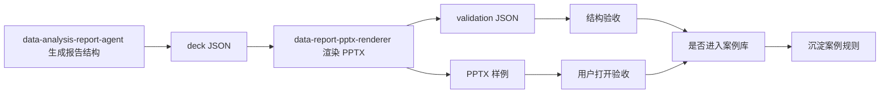

# PPTX 可编辑报告渲染 Skill 项目实施方案

版本：v1.0  
日期：2026-06-27  
角色：产品经理最终稿  
关联项目：data-analysis-report-agent  
目标渲染层：data-report-pptx-renderer

> **文档状态（2026-07-13）：渲染技术基线继续有效。** 独立 renderer、PptxGenJS、原生可编辑对象、PPTX + validation 和样例驱动仍是当前路线；分析到页面规划流程以 `pptx-analysis-to-deck-workflow-redesign-20260713.md` 为准。

## 1. 结论

本项目近期采用“样例驱动”的推进方式，而不是先做完整模板系统。

短期目标是把 data-analysis-report-agent 原有 HTML 报告的阅读质量，迁移到独立的 data-report-pptx-renderer skill 中，输出用户可以打开、编辑、验收的 PPTX 文件。

核心取舍：

- 可编辑性优先于像素级复刻。
- PptxGenJS 继续作为主渲染链路。
- 允许单背景、单图片作为阶段 1 辅助视觉。
- 用户确认过的样例才进入案例库。
- 阶段 3 模板自动导入/profile 系统暂缓。
- 阶段 5 平台化与自动视觉回归当前不做。

## 2. 项目目标

把原本 HTML 报告产出能力，迁移为可编辑 PPTX 产出能力。

这里的“复刻 HTML 质量”不是把 HTML 页面截图塞进 PPT，而是复刻报告能力：

- 结构清晰：标题、摘要、发现、证据、建议、来源齐全。
- 视觉正式：干净背景、中间画布、稳定字体、合理留白。
- 元素可编辑：文本框、表格、基础图表尽量使用 PPT 原生对象。
- 图表可解释：数据标签、参考线、重点标注、来源说明可维护。
- 可复用：通过 3-4 个案例沉淀为案例库，而不是先做抽象模板系统。

## 3. 当前用户确认边界

| 项目 | 用户确认结论 | 执行含义 |
| --- | --- | --- |
| 阶段 1 | 认可 | 先做可编辑 PPT 文件，允许单图片、单背景；组成报告的元素用户认可即通过 |
| 阶段 2 | 认可 | 输出增强样例，用户看样例验收 |
| 阶段 3 | 暂不做 | 模板自动导入/profile 系统放后面 |
| 案例库 | 要做 | 模板沉淀成 3-4 个具体产物，交给用户确认 |
| 阶段 5 | 当前不需要 | 不做完整平台化、自动视觉回归链路 |

## 4. 范围定义

### 4.1 本期做

| 范围 | 说明 |
| --- | --- |
| 独立 renderer skill | PPTX 渲染逻辑维护在 data-report-pptx-renderer，不塞回 data-analysis-report-agent |
| 阶段 1 可编辑 MVP | 生成可打开、可编辑、可验收的 PPTX |
| 阶段 2 质量增强 | 增强图表、文本框、背景、画布、版式 |
| 案例库 | 沉淀 3-4 个经用户确认的具体 PPTX 案例 |
| validation | 每次输出记录页数、文本、表格、图表、fallback、warning |

### 4.2 本期不做

| 不做项 | 原因 |
| --- | --- |
| HTML 整页截图作为主交付 | 违背可编辑 PPT 的目标 |
| 一次性支持所有图表类型 | 容易拖慢阶段 1 和阶段 2 验收 |
| Java/.NET 重运行时主链路 | 当前 Node/PptxGenJS 链路已经能支撑 MVP |
| 模板自动导入/profile 系统 | 阶段 3 暂缓，先用案例库验证真实需求 |
| 自动视觉回归平台 | 阶段 5 当前不需要 |

## 5. 阶段拆分

| 阶段 | 状态 | 目标 | 主要工作 | 通过标准 |
| --- | --- | --- | --- | --- |
| 阶段 1：可编辑 MVP | 本期优先 | 做出用户认可的可编辑 PPT 文件 | 标题、正文、表格、基础图表、来源、单背景/辅助图 | 用户确认“这个文件可以作为报告基础” |
| 阶段 2：报告质量增强 | 本期第二优先 | 让 PPT 更接近 HTML 报告阅读质量 | 数据标签、参考线、callout、留白、字体颜色、图表美化 | 用户确认“质量方向对，可以继续沉淀” |
| 阶段 3：模板/profile 系统 | 暂缓 | 从外部 PPT/POTX 自动抽取风格 | 暂不实施，仅保留技术预研 | 不验收 |
| 阶段 4：案例库 | 本期做 | 交付 3-4 个具体产物 | 经营诊断、趋势归因、排名对比、矩阵表格 | 用户逐个确认可进入长期案例库 |
| 阶段 5：平台化和视觉回归 | 当前不做 | 自动预览、自动视觉评分、平台集成 | 暂不实施 | 不验收 |

## 6. 阶段 1 验收标准

阶段 1 看“文件能不能用”，不看系统是否已经优雅。

| 验收项 | 标准 |
| --- | --- |
| 文件可打开 | PowerPoint 能正常打开生成的 .pptx |
| 主体可编辑 | 标题、正文、表格、基础图表主体可编辑 |
| 页面可读 | 不重叠、不乱版、背景干净 |
| 报告元素完整 | 至少包含标题页、摘要页、发现页、图表/表格页、来源页 |
| 用户可认可 | 用户认为它是正式报告基础，而不是调试样张 |
| 可追踪 | 生成 validation，记录页数、文本、表格、图表、fallback、warning |

阶段 1 允许：

- 单背景。
- 单图片作为辅助视觉。
- 基础图表先不做到最终咨询级。
- 少量 fallback，但必须在 validation 中透明记录。

阶段 1 不允许：

- 用 HTML 整页截图冒充可编辑 PPT。
- 页面元素明显重叠。
- 只有图片，没有可编辑主体对象。

## 7. 阶段 2 验收标准

阶段 2 看“质量是否明显提升”，必须输出样例给用户验收。

| 验收项 | 标准 |
| --- | --- |
| 图表表达 | 至少体现数据标签、参考线、重点标注、来源 |
| 版式质量 | 背景干净，中间画布清晰，文本框不抢图表空间 |
| 字体颜色 | 形成稳定规范，如标题、正文、注释、来源分层明确 |
| 可编辑性 | 主体仍保持 PPT 原生对象可编辑 |
| 样例验收 | 至少输出一个完整样例 PPTX 给用户确认 |
| fallback 透明 | 不可编辑对象必须标明原因和影响 |

阶段 2 优先优化：

- rank_bar / bar / line 这类报告高频图表。
- 图表上的数据标签、参考线、重点项标注。
- 正式报告常见的结论框、callout、来源说明。
- 背景与中间画布的稳定布局。

## 8. 案例库交付

模板不先做抽象系统，先沉淀具体案例。

首批建议交付 3-4 个产物：

| 案例 | 用途 | 核心验证点 |
| --- | --- | --- |
| sample-editable-basic.pptx | 阶段 1 基础可编辑报告 | 元素完整、可编辑、可打开 |
| sample-chart-enhanced.pptx | 阶段 2 图表增强样例 | 标签、参考线、标注、版式 |
| sample-trend-diagnostic.pptx | 趋势归因类报告 | 折线趋势、异常点、解释文本 |
| sample-matrix-table.pptx | 矩阵/表格类报告 | 表格层次、分组、结论框 |

每个案例必须包含：

- PPTX 文件。
- 输入 JSON。
- validation JSON。
- 使用场景说明。
- 版式和图表规则说明。
- 用户确认状态。

案例库进入标准：

1. 用户确认可用。
2. 主体元素可编辑。
3. validation 无阻断错误。
4. fallback 可解释。
5. 可被后续报告 skill 调用或复用。

## 9. 角色分工

| 角色 | 职责 |
| --- | --- |
| 产品经理 agent | 控制范围、定义验收、维护样例进入案例库的标准 |
| data-analysis-report-agent | 负责分析结论、数据、图表语义、来源，不负责 PPT 渲染细节 |
| data-report-pptx-renderer | 负责 PPT 版式、原生对象、图表渲染、validation |
| UI/design agent | 阶段 2 后参与视觉审查，避免阶段 1 过早扩大范围 |
| 测试/验收角色 | 验证 PPT 可打开、可编辑、对象数量、fallback 记录 |

## 10. 推荐工作流

## 11. 风险与回退

| 风险 | 表现 | 处理方式 |
| --- | --- | --- |
| 过度追求 HTML 像素级复刻 | 把工作拖向截图和复杂前端渲染 | 改为“报告阅读质量复刻”，不是“像素复刻” |
| 图表复杂度拖慢阶段 1 | 一直调图表细节，无法交付可用文件 | 阶段 1 只做基础可编辑，复杂图表放阶段 2 |
| 模板系统变成大工程 | profile、母版、自动导入持续扩张 | 阶段 3 暂缓，先交付案例库 |
| fallback 失控 | PPT 里大量不可编辑图片 | validation 必须记录 fallback 类型、原因、影响 |
| 用户不认可视觉方向 | 技术上可编辑，但不像正式报告 | 回退到样例局部调整，不推翻主渲染链路 |
| 自动预览工具不足 | 暂时无法批量截图评分 | 先用结构验证 + 人工打开验收 |

## 12. 产物地图

| 产物 | 路径建议 | 生命周期 | 说明 |
| --- | --- | --- | --- |
| 实施方案 | docs/pptx-renderer-implementation-plan-20260627.md | 长期维护 | 本文件 |
| 阶段 1 样例 | data-report-pptx-renderer/outputs/sample-editable-basic.pptx | 用户验收后保留 | 可编辑 MVP |
| 阶段 2 样例 | data-report-pptx-renderer/outputs/sample-chart-enhanced.pptx | 用户验收后保留 | 图表增强 |
| 案例库索引 | data-report-pptx-renderer/references/case_library.json 或 examples/case-library.md | 长期维护 | 只记录用户确认案例 |
| validation | 与 PPTX 同目录 | 随样例保留 | 页数、对象数、fallback、warning |

## 13. 后续执行规则

1. 不把 HTML 整页截图作为主交付。
2. 每个阶段必须有用户可打开的 PPTX 样例。
3. 用户认可的样例才进入案例库，未确认样例不升格为模板。
4. 先做具体案例，再抽象规则。
5. 复杂图表优先服务报告表达，不追求图表库完整性。
6. validation 必须持续输出页数、原生文本、原生表格、原生图表、fallback、warning。
7. 阶段 1 完成前，不启动模板自动导入/profile 大工程。
8. 阶段 2 完成后，再决定是否恢复阶段 3。
9. renderer skill 只做渲染层，不承担分析逻辑。
10. report skill 只传结构化报告和图表语义，不直接控制 PPT 细节。

## 14. 下一步

建议下一步只做两件事：

1. 在 data-report-pptx-renderer 中固化阶段 1 的规则和样例。
2. 生成 sample-editable-basic.pptx，让用户先验收可编辑 PPT 的基本效果。

阶段 1 用户确认后，再进入阶段 2 的图表和版式增强。
