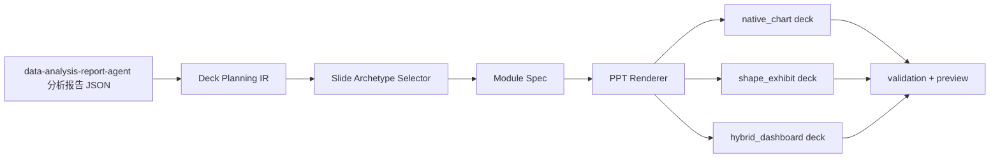

# PPT 模板级高密度汇报能力重构报告与实施计划

版本：v2.0  
日期：2026-07-05  
角色：产品经理  
关联项目：data-analysis-report-agent  
目标渲染层：data-report-pptx-renderer  
参考目标：用户提供的三张高密度汇报 PPT 参考图

> **文档状态（2026-07-13）：案例参考。** 可编辑性、组件、主题和渲染技术结论继续有效；固定 archetype、固定模块密度、固定拆页和先定模板再填素材的流程假设，已由 `pptx-analysis-to-deck-workflow-redesign-20260713.md` 替代，不再作为全局验收规则。

## 1. 一句话结论

当前 PPT 能力不应该继续按“干净咨询页”小修小补，而应该升级为“模板级高密度汇报 PPT”能力。原来的数据分析、语义理解、证据链和 HTML 报告能力全部保留；需要重做的是报告到 PPT 之间的 Deck Planning IR、模板级页面类型、组件库、图表表现模式和验收标准。

## 2. 用户真实需求理解

用户要的不是普通 PowerPoint 导出，也不是把 HTML 截图塞入 PPT。用户要的是：

1. 数据分析报告的思考能力保留。
2. PPT 成品接近老板汇报和咨询 deck。
3. 页面要高密度，不追求大留白。
4. 图表、文本、指标卡、对比结构、解释框、箭头、装饰层要共同组成正式汇报页。
5. 输出文件要可编辑，但可编辑分为两类：
   - 原生图表数据可编辑：可以打开 PowerPoint 图表数据表改数。
   - 页面元素可编辑：文本、形状、卡片、箭头、标签、图表部件可以手动改。
6. 用户希望同时看到两类路线效果，不接受单一路径过早锁死。

用户给出的参考图显示，目标已经从“简洁咨询报告”升级为“商业模板级汇报页”。这些页面的核心不是单个图表，而是整页的信息架构。

## 3. 参考图特征拆解

| 参考类型 | 页面特征 | 对能力的要求 |
| --- | --- | --- |
| 对比信息页 | VS 圆形对比、左右指标组、底部原因卡片、箭头和徽章 | 需要 `comparison_vs` 页面 archetype 和 VS 组件 |
| 问题改进页 | 上下两段问题/改进结构、三列问题卡、三列解决方案卡、侧边总结框 | 需要 `problem_solution_grid` archetype |
| 存在问题/改进办法页 | 左右大色带、年份箭头、指标组、底部结论块 | 需要 `before_after_comparison` archetype |
| 数据看板页 | 左侧 KPI 栈、主趋势图、环图、解释文本、绿色主题 | 需要 `dashboard_performance` archetype |
| 业绩分析页 | 四列业务卡、每列内含图表、指标、解释、底部结论条 | 需要 `multi_metric_scorecard` archetype |

## 4. 当前能力差距

| 层级 | 当前状态 | 差距 |
| --- | --- | --- |
| 数据分析层 | 能输出结构化结论、证据、图表指令 | 不需要推倒 |
| HTML 报告层 | 阅读质量较高，适合长文报告 | 可继续保留 |
| PPT schema | 只有 title、executive_summary、finding_with_chart、finding_with_table、matrix、notes_sources 等少量布局 | 无法承载参考图的复杂整页结构 |
| 图表能力 | 支持原生 bar、rank_bar、line、pie、表格、参考线、标注 | 不足以表达看板、VS、环形进度、KPI 栈、多卡片图表 |
| 视觉系统 | 有 Swiss/consulting 风格、背景、字体、颜色规则 | 模板感不足，缺少装饰层和组件级规则 |
| 验收体系 | validation 主要记录对象数量、fallback、原生 chart | 不能判断是否达到模板级汇报效果 |

## 5. 根因判断

### 5.1 不是数据分析能力失败

数据产出、语义理解、指标解释和结论推理仍是核心资产。用户认可的 HTML 报告能力应继续作为上游能力。

### 5.2 不是简单图表美化问题

用户参考图中的图表只是页面的一部分。真正需要的是：

- 页面结构规划；
- 多模块信息密度控制；
- 模板化组件复用；
- 汇报故事线；
- 图表和文案容器协同。

### 5.3 主根因是缺少 Deck Planning IR

当前从 report JSON 直接到 PPT renderer，中间缺少一层描述：

- 每页承担什么汇报角色；
- 一句话主张是什么；
- 哪些证据进入主图，哪些进入旁注；
- 页面采用哪种 archetype；
- 图表用原生 chart 还是 shape exhibit；
- 哪些元素必须数据可编辑，哪些只要元素可编辑；
- 页面密度和模块数量上限。

没有这层，renderer 只能“排版”，不能“设计汇报页”。

## 6. 产品原则

1. 保留分析大脑，不把 PPT 渲染逻辑塞回 data-analysis-report-agent。
2. 新增 Deck Planning IR，让报告语义先转成可汇报的页面计划。
3. PPT renderer 不再只接收 chart/table，而要接收 slide archetype 和 modules。
4. 支持两条图表路线：
   - `native_chart`：优先数据可编辑。
   - `shape_exhibit`：优先模板视觉和页面控制。
5. 增加第三种折中模式：
   - `hybrid_dashboard`：主趋势或柱图保留原生 chart，复杂卡片、标注、环图、VS、装饰层用形状组件。
6. 先做 3 页复刻样本，再沉淀规则。不能只写规则不做可见样本。
7. 用户确认的样本才能进入案例库。

## 7. 目标能力树

| 能力域 | 子能力 | 优先级 | 说明 |
| --- | --- | --- | --- |
| Deck Planning IR | slide_role、claim、evidence_refs、archetype、density、visual_mode | P0 | 首先补齐 |
| 页面 archetype | comparison_vs、problem_solution_grid、before_after_comparison、dashboard_performance、multi_metric_scorecard | P0 | 对齐参考图 |
| 组件库 | KPI 卡、VS 圆、环形进度、箭头、标签条、解释卡、底部结论条 | P0 | 模板级视觉核心 |
| 图表模式 | native_chart、shape_exhibit、hybrid_dashboard | P0 | 满足两种可编辑诉求 |
| 模板主题 | 米金对比主题、深绿看板主题、灰绿运营主题 | P1 | 先做 2-3 套 |
| 验收体系 | 视觉评分、密度评分、可编辑评分、图表数据可改评分 | P1 | 补现有 validation 缺口 |
| 模板导入 | 从外部 PPT/POTX 抽取 profile | P2 | 暂不优先 |

## 8. 推荐技术路线



## 9. 新 Deck Planning IR 草案

示例结构：

```json
{
  "deck_goal": "老板汇报/咨询 deck",
  "density": "consulting_high_density",
  "theme_id": "green_gold_dashboard",
  "slides": [
    {
      "slide_role": "core_comparison",
      "archetype": "comparison_vs",
      "claim": "1-3 年与 3-5 年构成岗位需求主体",
      "evidence_refs": ["experience_mix", "salary_by_experience"],
      "visual_mode": "hybrid_dashboard",
      "editability_policy": {
        "main_chart": "native_chart",
        "decorations": "editable_shapes",
        "kpi_cards": "editable_shapes"
      },
      "modules": [
        {"type": "vs_circles", "data_ref": "experience_mix"},
        {"type": "side_metric_list", "position": "left"},
        {"type": "side_metric_list", "position": "right"},
        {"type": "reason_cards", "count": 4}
      ]
    }
  ]
}
```

## 10. 三种输出模式定义

| 模式 | 目标 | 可编辑性 | 适用页面 | 缺点 |
| --- | --- | --- | --- | --- |
| `native_chart` | 数据可改优先 | 图表数据表可编辑，文本表格可编辑 | 严肃数据复核、需要改数的分析页 | 视觉控制较弱 |
| `shape_exhibit` | 视觉效果优先 | 文字、形状、图表部件可编辑 | 老板汇报、模板页、强视觉页 | 不能直接打开 chart 数据表改数 |
| `hybrid_dashboard` | 平衡数据可改和模板效果 | 主图尽量原生，卡片和装饰用形状 | 数据看板、业绩分析、对比页 | 实现复杂度最高 |

产品建议：默认使用 `hybrid_dashboard`，并允许用户在生成时指定：

- `prefer_data_editability`
- `prefer_visual_template`
- `balanced_consulting`

## 11. 阶段计划

### 阶段 0：目标校准和样本定义

状态：本报告完成后进入。

目标：明确参考图对应的三类 MVP 样本。

产物：

- 本报告。
- 3 页复刻样本需求说明。
- 验收标准。

通过标准：

- 用户确认以参考图为目标。
- 用户确认先做 3 页样本，不先做完整系统。

### 阶段 1：三页复刻样本

目标：用真实 PPTX 做出接近参考图的效果，验证 renderer 是否能承载模板级页面。

样本页：

| 页 | archetype | 对应参考 | 目标 |
| --- | --- | --- | --- |
| 1 | `comparison_vs` | 图 1 上半页 | VS 圆形对比、左右指标组、底部原因卡 |
| 2 | `problem_solution_grid` | 图 2 上半页和下半页 | 问题分析、改进办法、多卡片结构 |
| 3 | `dashboard_performance` | 图 3 上半页 | KPI 侧栏、趋势图、环图、解释框 |

输出：

- `D:\知识库\work\data-analysis-report-agent\outputs\template-level-reference-replay-3page.pptx`
- `D:\知识库\work\data-analysis-report-agent\outputs\template-level-reference-replay-3page.validation.json`
- `D:\知识库\work\data-analysis-report-agent\outputs\template-level-reference-replay-3page-preview\`

验收：

- 用户打开后认为方向接近参考图。
- 页面不是空泛干净页，而是高密度模板页。
- 80% 以上元素是可编辑文本或形状。
- 至少一个主图保留原生 chart 数据表，用于验证 hybrid 路线。

### 阶段 2：沉淀 archetype 和组件库

目标：把样本中的成功结构沉淀成 renderer 可复用规则。

新增规则文件建议：

| 文件 | 用途 |
| --- | --- |
| `references/deck_planning_schema.json` | Deck Planning IR |
| `references/slide_archetype_library.json` | 页面类型库 |
| `references/module_component_library.json` | KPI、VS、环图、箭头、卡片等组件 |
| `references/template_theme_library.json` | 米金、深绿、灰绿主题 |
| `references/template_level_validation_rules.md` | 模板级验收规则 |

验收：

- 三页样本不靠一次性脚本硬编码。
- 至少 3 个 archetype 可通过结构化 JSON 生成。
- validation 能区分 `native_chart`、`shape_exhibit`、`hybrid_dashboard`。

### 阶段 3：接入 data-analysis-report-agent

目标：让原分析报告能输出 Deck Planning IR，而不是直接输出 deck JSON。

改造点：

| 模块 | 改造 |
| --- | --- |
| data-analysis-report-agent | 增加 PPT planning handoff，不改变分析逻辑 |
| data-report-pptx-renderer | 支持 deck planning 输入和 module 渲染 |
| examples | 增加 3-4 个用户确认案例 |
| validation | 增加模板级评分 |

验收：

- 同一份分析报告可以生成普通报告 PPT 和模板级汇报 PPT。
- 用户可以选择视觉模式。
- 结论、证据、来源不丢失。

### 阶段 4：案例库

目标：沉淀用户认可的模板案例。

首批建议案例：

| 案例 | 用途 |
| --- | --- |
| `comparison-information-gold` | 对比信息/VS 页 |
| `problem-improvement-gold` | 问题分析和改进页 |
| `green-performance-dashboard` | 数据看板/业绩成果页 |
| `multi-card-operation-review` | 四卡片经营复盘页 |

验收：

- 每个案例有 PPTX、输入 JSON、预览图、validation、适用说明。
- 用户确认后才进入长期案例库。

## 12. 验收标准

### 12.1 视觉验收

| 项 | 标准 |
| --- | --- |
| 模板感 | 页面看起来像商业 PPT 模板，而不是自动生成的干净报告 |
| 密度 | 一页允许 6-12 个模块，但不能重叠 |
| 层级 | 标题、主图、卡片、注释、来源层级明确 |
| 色彩 | 有明确主题色，不是随机多色 |
| 装饰 | 箭头、色带、卡片、徽章服务内容，不只是装饰 |

### 12.2 可编辑验收

| 项 | 标准 |
| --- | --- |
| 文本 | 标题、正文、卡片文字可编辑 |
| 形状 | 卡片、箭头、色带、圆形、标签可编辑 |
| 表格 | 能用 PowerPoint 表格对象编辑 |
| 原生图表 | hybrid 模式至少保留一个主图可改数据 |
| fallback | 不允许整页截图；图片 fallback 必须说明原因 |

### 12.3 数据和语义验收

| 项 | 标准 |
| --- | --- |
| 结论一致 | PPT 主张不背离分析报告 |
| 证据可追 | 每页至少有 evidence_ref 或 source_ref |
| 口径说明 | 图表和指标有单位、范围、边界 |
| 不乱编 | 装饰和模板不能制造不存在的数据 |

## 13. 预计修改影响矩阵

| 文件/模块 | 目的 | 上下游影响 | 验证方式 | 回退方式 |
| --- | --- | --- | --- | --- |
| `data-report-pptx-renderer/references/deck_report_schema.json` | 扩展或兼容新 IR | 影响 renderer 输入校验 | 用旧样例和新样例双跑 | 保留旧 schema 分支 |
| `references/slide_archetype_library.json` | 新增页面类型库 | renderer 可按 archetype 渲染 | 生成三页样本 | 删除新增 archetype |
| `references/module_component_library.json` | 新增组件定义 | 多页面复用 KPI、VS、环图等 | 组件级样例验证 | 回退到现有 layout |
| `scripts/render_pptx.mjs` | 支持 module 渲染 | 影响所有 PPTX 输出 | 旧样例回归 + 新样例验证 | 保留旧渲染函数 |
| `examples/template-level-reference-replay-3page.json` | 样本输入 | 提供验收基准 | 生成 PPTX 和预览图 | 删除样本 |
| `data-analysis-report-agent/SKILL.md` | 增加 PPT planning handoff 规则 | 上游输出更结构化 | plan validator 或样例手动检查 | 不改分析逻辑，仅回退 handoff |

## 14. 风险和取舍

| 风险 | 说明 | 产品取舍 |
| --- | --- | --- |
| 原生 chart 无法完全复刻参考图 | PowerPoint 原生 chart 的视觉控制有限 | 接受 hybrid，不强制全原生 |
| shape exhibit 不能直接改数据表 | 形状图表只能手动改形状和数字 | 在关键图表保留原生 chart 版本 |
| 模板复杂度上升 | 一页模块多，自动排版更难 | 先固定 3-5 个 archetype，不泛化 |
| 过早做模板导入 | 外部 PPT/POTX profile 系统复杂 | 放到后续，先做案例库 |
| 视觉接近但数据语义变弱 | 模板装饰可能压过分析结论 | 每页必须有 claim 和 evidence_ref |

## 15. 产品经理推荐决策

推荐走 `hybrid_dashboard` 主路线。

原因：

1. 用户目标是老板汇报/咨询 deck，视觉要求高。
2. 用户仍关心图表可编辑，所以不能完全 shape 化。
3. 参考图本身更像模板组件堆叠，不是标准数据图表。
4. hybrid 可以让主图保留数据可编辑，其他高视觉模块用形状和文本实现。

不推荐继续只优化现有 `finding_with_chart`。

原因：

- 它最多能做“单图 + 解读侧栏”。
- 无法表达参考图里的 VS、KPI 栈、多图表看板、问题改进结构。
- 继续调图表颜色和标注会陷入局部优化，不能解决主结构问题。

## 16. 下一步最小动作

下一步只做一件事：生成三页参考复刻样本。

建议执行顺序：

1. 建立 `template-level-reference-replay-3page.json`。
2. 写或扩展 renderer，使其支持 3 个 archetype：
   - `comparison_vs`
   - `problem_solution_grid`
   - `dashboard_performance`
3. 生成 PPTX。
4. 用 PowerPoint COM 导出 PNG 预览。
5. 让用户只判断方向是否接近参考图。

不在下一步做：

- 不接入完整 data-analysis-report-agent。
- 不做外部模板自动导入。
- 不做 10 页完整报告。
- 不做全类型图表库。

## 17. 给用户的确认点

需要用户确认的不是技术细节，而是视觉方向：

1. 三页复刻样本是否以参考图的“米金对比”和“深绿看板”为主。
2. 是否接受 hybrid 路线作为默认路线。
3. 如果一个页面必须在“数据表可编辑”和“模板视觉强”之间取舍，默认选择哪一个。

产品经理建议默认：

- 老板汇报页：优先模板视觉强。
- 数据复核页：优先原生 chart 数据可编辑。
- 综合报告页：走 hybrid。
