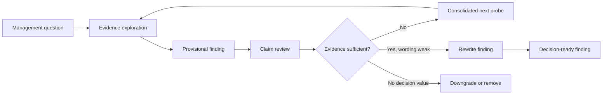

# Analysis Material Pack Contract

Use this contract when analysis must feed a dense HTML/React report, a Deck Architect, or another downstream renderer.

The analysis Agent owns this pack. It should intentionally overproduce evidence and candidate explanations so downstream agents can select and compose without inventing facts. The pack is not a slide plan and must not be trimmed to a target page count.

## Pipeline Position

```mermaid
flowchart LR
  A["Data and semantic layer"] --> B["Analysis goal"]
  B --> C["Value-driven exploration"]
  C --> D["Decision-ready synthesis and claim review"]
  D --> E["analysis_material_pack v0.3"]
  E --> F["Locked visual data, structure, and position"]
  F --> G["Report Text Controller<br/>bounded unit packets"]
  G --> H["Chain of Verification"]
  H -->|"critical gap"| C
  H -->|"verified"| I["Manifest-configured Report Text Editor"]
  H -->|"limited but useful"| Q["Detachable bounded module"]
  I --> J["Independent adversarial reviewer"]
  J --> K["Controller resolution + progressive summary"]
  K --> L["Validated report_text_pack v0.4"]
  L --> M["Manifest-configured dense HTML or React"]
  E --> N["Deck Architect"]
  N --> O["Human-approved outline"]
  O --> P["Editable PPT renderer"]
```



The analysis Agent decides what is worth investigating. The Deck Architect decides what is worth presenting. Do not let page count, slide templates, or renderer limitations drive analysis depth.

## Core Rules

1. Start from `analysis_goal`, metric definitions, decision context, and evidence boundaries.
2. Explore until another probe has low expected value, weak evidence, low impact, weak relevance, or little marginal explanatory value.
3. Treat roughly three levels as an optional search-budget heuristic, never as a required output depth.
4. Record every explored branch as `continue` or `stop` with an explicit reason.
5. Do not stop at a numerically correct observation. Convert supported facts into a decision-ready provisional finding that states scope, evidence strength, business meaning, and intended management use.
6. Review every provisional finding once before handoff. Rewrite weak wording when the evidence is sufficient; return to analysis when a calculation or evidence gap prevents an accurate conclusion; downgrade or remove material that has no decision value.
7. Separate verified findings, candidate explanations, boundaries, and gaps.
8. Register all usable evidence and chart candidates even when they will not enter the final report.
9. Bind every chart candidate to the finding it proves, its decision role, visual priority, and focus target. Do not leave a central quantitative change as text when a useful comparison can show it.
10. Keep parent scope on every child explanation. A child cannot silently become an independent explanation of the top-level movement.
11. Do not ask the Report Text Controller, Report Text Editor, adversarial reviewer, Deck Architect, or renderer to calculate missing evidence, invent business meaning, or repair a weak conclusion. The Controller must route critical evidence gaps back to the analysis/ReAct layer.
12. For HTML/React, lock each selected visual's data, structure, and report position before the Controller creates a bounded unit packet. The temperature-0 Editor receives one verified unit at a time; the independent reviewer receives the same bounded evidence but not the writer's hidden reasoning; the renderer receives only validated text.

## Required v0.3 Shape

```json
{
  "analysis_material_pack": {
    "contract_version": "0.3",
    "analysis_goal": {
      "question": "Why did the metric move?",
      "audience": "Management",
      "decision_to_support": "Decide where to investigate or intervene.",
      "time_scope": "2026-06 vs 2026-05"
    },
    "metric_context": [],
    "validated_findings": [],
    "candidate_explanations": [],
    "evidence_inventory": [],
    "chart_candidates": [],
    "boundaries": [],
    "gaps": [],
    "claim_review_log": {"entries": []},
    "analysis_decision_log": {"entries": []}
  }
}
```

These fields are the stable collaboration skeleton. Their arrays stay open to diagnostic, comparison, explanatory, experimental, funnel, operating-review, and other analytical patterns.

## Analysis Goal And Metric Context

```json
{
  "analysis_goal": {
    "question": "Where did the sales decline occur and what evidence explains it?",
    "audience": "Management",
    "decision_to_support": "Prioritize the next intervention or investigation.",
    "time_scope": "2024-11 vs 2024-10"
  },
  "metric_context": [
    {
      "metric_id": "sales_amount",
      "definition": "Recognized order sales amount",
      "unit": "CNY",
      "grain": "order line",
      "filters": {},
      "source_refs": ["orders"]
    }
  ]
}
```

## Decision-Ready ReAct And Claim Review

The analysis loop must continue beyond data correctness:



Before finalizing a finding, answer:

1. What happened, where, and by how much?
2. Why is the movement material for the stated audience and decision?
3. Is the finding descriptive, associative, causal, or counterevidence?
4. What alternative explanation or contradictory evidence was considered?
5. Should management intervene, investigate, monitor, deprioritize, or take no action?
6. What next validation question is most likely to change that decision?
7. Which evidence and visual form can prove the final wording without invention?

Do not require a fixed number of probes or analytical levels. Continue only
while another probe has material expected decision value.

## Findings And Candidate Explanations

Verified findings are safe to state within their declared boundary:

```json
{
  "finding_id": "finding_furniture_decline",
  "statement": "Furniture contributed 73.3% of the November sales decline and should be the first investigation scope.",
  "scope": "2024-11 vs 2024-10, valid order lines grouped by category",
  "importance": "high",
  "confidence": "high",
  "causal_status": "associative",
  "management_implication": "Focus diagnostic capacity on furniture instead of spreading it evenly across categories.",
  "recommended_use": "investigate",
  "next_validation_question": "Which furniture regions, subcategories, or segments account for the decline?",
  "evidence_refs": ["category_delta"],
  "boundary_refs": ["boundary_parallel_slices"]
}
```

`recommended_use` is one of `intervene`, `investigate`, `monitor`,
`deprioritize`, or `no_action`. `causal_status` is one of `descriptive`,
`associative`, `causal`, or `counterevidence`. An `investigate`, `monitor`, or
`deprioritize` finding must include a concrete `next_validation_question`.

Candidate explanations preserve useful but weaker material:

```json
{
  "candidate_id": "candidate_north_region",
  "parent_id": "finding_furniture_decline",
  "statement": "North China is the largest regional slice of the furniture decline.",
  "status": "verified_slice",
  "expected_value": "high",
  "evidence_refs": ["furniture_region_delta"]
}
```

`status` is an open analytical label, but it must not disguise a hypothesis as verified. Prefer clear labels such as `verified`, `verified_slice`, `partially_supported`, `hypothesis`, `needs_data`, `contradicted`, or `rejected`.

Every validated finding must have one final review entry:

```json
{
  "finding_id": "finding_furniture_decline",
  "candidate_statement": "Furniture was the largest declining category.",
  "final_statement": "Furniture contributed 73.3% of the November sales decline and should be the first investigation scope.",
  "review_status": "rewritten",
  "review_reason": "The candidate stated a rank but not its management use.",
  "checks": {
    "factually_supported": true,
    "business_meaning_clear": true,
    "decision_direction_clear": true,
    "causal_strength_appropriate": true,
    "alternative_explanations_considered": true,
    "visual_evidence_sufficient": true
  }
}
```

Use `approved_as_written` only when candidate and final wording are identical.
Use `rewritten` only when the final wording actually changes. A failed check
must be resolved upstream before the finding enters `validated_findings`.

## Evidence And Chart Inventories

```json
{
  "evidence_inventory": [
    {
      "evidence_id": "furniture_region_delta",
      "type": "table",
      "subject": "Furniture sales delta by region",
      "grain": "region-month",
      "data_ref": "analysis.tables.furniture_region_delta",
      "quality": "validated",
      "source_refs": ["orders"],
      "availability": "ready"
    }
  ],
  "chart_candidates": [
    {
      "chart_id": "furniture_region_rank",
      "question_answered": "Which regions account for the furniture decline?",
      "finding_refs": ["finding_furniture_decline"],
      "message_to_prove": "Furniture decline is concentrated in a small number of regions.",
      "decision_role": "driver",
      "visual_priority": "supporting",
      "focus_target": "largest negative region",
      "why_visual_not_text": "A sorted bar chart preserves direction, rank, and relative magnitude across regions.",
      "evidence_refs": ["furniture_region_delta"],
      "recommended_form": "rank_bar",
      "editability_need": "native_chart_preferred"
    }
  ]
}
```

`decision_role` is one of `issue_judgement`, `magnitude`, `driver`,
`counterevidence`, `boundary`, or `action`. `visual_priority` is one of
`dominant`, `supporting`, or `optional`. These fields express analytical
meaning and hierarchy, not page coordinates or final visual design. Use
`driver` only when the evidence supports a decomposition or explanatory
relationship within its stated boundary. An operating signal that only changes
investigation priority should use `issue_judgement`; evidence that weakens or
rules out a proposed explanation should use `counterevidence`.

There is no minimum chart count. A chart exists only when it answers a useful question. Evidence that is not charted remains in the inventory and must not disappear silently.

## Boundaries And Gaps

```json
{
  "boundaries": [
    {
      "boundary_id": "boundary_parallel_slices",
      "scope": "Furniture subcategory, region, and customer segment are parallel slices.",
      "limitation": "Their deltas cannot be added together as independent causes.",
      "affected_material_refs": ["candidate_subcategory", "candidate_region", "candidate_segment"]
    }
  ],
  "gaps": [
    {
      "gap_id": "gap_north_province_conditional",
      "question": "Which provinces explain the North China furniture decline?",
      "importance": "medium",
      "expected_value": "medium",
      "feasibility": "requires_conditional_extract",
      "related_refs": ["candidate_north_region"]
    }
  ]
}
```

## Analysis Decision Log

The log is an audit of decisions, not hidden chain-of-thought.

```json
{
  "analysis_decision_log": {
    "entries": [
      {
        "branch_id": "candidate_north_region",
        "parent_id": "finding_furniture_decline",
        "question": "Is the furniture decline concentrated by region?",
        "decision": "continue",
        "reason": "The regional slice has high impact and can change the next investigation priority.",
        "evidence_refs": ["furniture_region_delta"],
        "impact_estimate": "high",
        "confidence": "high",
        "marginal_explanatory_value": "high",
        "next_probe": "Check conditional province evidence within North China.",
        "depth": 1
      },
      {
        "branch_id": "gap_north_province_conditional",
        "parent_id": "candidate_north_region",
        "question": "Can current province evidence prove the North China child claim?",
        "decision": "stop",
        "reason": "The available province table is furniture-wide rather than conditional on North China.",
        "evidence_refs": [],
        "impact_estimate": "unknown",
        "confidence": "high",
        "marginal_explanatory_value": "unknown",
        "next_probe": null,
        "depth": 2
      }
    ]
  }
}
```

Rules:

1. Every candidate explanation must have a corresponding decision-log entry.
2. `continue` requires a concrete `next_probe`.
3. `stop` requires a reason but does not require a next probe.
4. Depth is descriptive only. Validation must never require a fixed maximum or minimum depth.
5. The log may contain probes that did not become candidate explanations, provided their parent and evidence scope remain explicit.

## Optional Driver Tree And React Projection

`driver_tree`, `diagnosis_frame`, and `react_context_projection` remain optional presentation projections for compatible HTML/React experiences. They are not the canonical v0.3 material model.

When a driver tree is useful:

1. Preserve `parent_id`, inherited metric, inherited time scope, and parent analysis boundary.
2. Allow any number of children, including zero when a branch legitimately stops.
3. Do not require a 3x3 pattern, a fixed number of main drivers, or a fixed depth.
4. Keep weak children labeled as hypotheses or gaps.

The Report Text Controller may select a relevant projection for a context-bounded unit when it clarifies scope, but the Editor must not reconstruct or upgrade claims from display strings. React may render only the approved text pack using the renderer Agent manifest.

## Downstream Rules

1. Final executive findings remain concise; the material pack remains intentionally richer.
2. The Deck Architect receives already reviewed, decision-ready findings. It may select, merge, drop, or sequence them, but it must not invent business meaning or rewrite an unsupported claim.
3. A backfill request contains all decision-critical gaps in one batch. After that response, remaining gaps require a human decision; agents must not loop automatically.
4. Deck Architect and slide agents must cite material and evidence IDs rather than recompute analysis.
5. HTML/React receives a validated `report_text_pack`; its renderer may not add analytical prose. PPT renderers receive only human-approved claims, evidence, boundaries, and visual instructions.
6. PNG is a presentation choice, never a substitute for missing quantitative evidence.

## Legacy Compatibility

Validators continue accepting v0.2 packs in compatibility mode and earlier
driver-tree packs as historical fixtures. New dense-report and PPT-bound runs
must emit v0.3.
