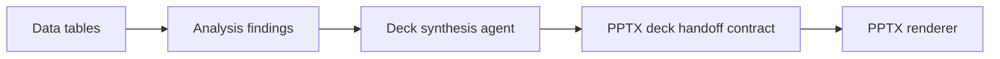
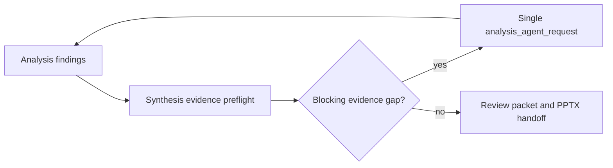

# Deck Synthesis Contract

Use this contract before creating the editable PPTX deck handoff.

The synthesis layer answers the question: "Given the data table and analytical conclusions, what should each PPT page say and how should multiple findings be combined?"

The synthesis layer must produce two artifacts:

1. `deck_synthesis.json`: the canonical machine-readable contract.
2. `deck_synthesis_review.md`: the human-readable review view generated from each slide's `review_packet`.

The user should be able to approve or reject information density from `deck_synthesis_review.md` before any PPTX is rendered.

## Position In The Pipeline



The PPTX renderer should not decide which analytical conclusions belong together. It should receive a prepared slide contract.

The deck synthesis agent should not redo analysis. The data analysis agent owns data extraction, metric definitions, calculations, analytical judgement, and final findings. The deck synthesis agent owns page-question interpretation, evidence role classification, missing-evidence triage, and slide blueprinting.

If evidence is missing, the synthesis layer must gather all gaps and create one consolidated request back to the data analysis agent. It must not ask repeatedly or invent the missing evidence.



## Required Top-Level Shape

```json
{
  "synthesis_version": "0.1",
  "task": "turn_findings_into_slide_stories",
  "deck_goal": "boss_consulting_deck",
  "audience": "management",
  "source_report_ref": "final_report",
  "sources": [],
  "findings": [],
  "slides": []
}
```

## Finding Shape

Each finding must have a stable ID:

```json
{
  "id": "f_channel_decline",
  "claim": "传统渠道贡献 5.1 个百分点下降",
  "evidence_refs": ["driver_decomposition"],
  "metric": "销售额",
  "direction": "down",
  "impact_value": -5.1
}
```

## Synthesis Slide Shape

Each synthesis slide must include:

| Field | Purpose |
| --- | --- |
| `id` | Stable synthesis slide ID |
| `slide_goal` | Why this slide exists |
| `primary_claim` | The final page headline claim |
| `included_findings` | Finding IDs merged into the page |
| `evidence_refs` | Source IDs used by the merged claim |
| `layout_archetype` | Analytical structure, such as `driver_attribution` |
| `merge_logic` | Why these findings belong together |
| `interpretation_packet` | Page question, audience decision, finding roles, required evidence, gaps, and analysis-agent request status |
| `review_packet` | Human-reviewable dense page blueprint |
| `composition` | Reader order and intended content containers |
| `output_slide_contract` | Fields that become the PPTX deck slide |

## Interpretation Packet Shape

Before creating `review_packet`, every synthesis slide must include an `interpretation_packet`:

```json
{
  "page_question": "6月销售额是否异常下降，主要原因是什么？",
  "audience_decision": "判断是否需要管理干预，并确定优先处理顺序",
  "story_pattern": "movement_attribution_dense",
  "finding_roles": [
    {"finding_ref": "f_total_decline", "role": "issue_context"},
    {"finding_ref": "f_channel_decline", "role": "driver_explanation"}
  ],
  "required_evidence": [
    "trend_series",
    "movement_threshold",
    "driver_contribution",
    "driver_mechanism",
    "action_priority"
  ],
  "missing_evidence_requests": [],
  "analysis_agent_request": {
    "status": "not_needed",
    "request_mode": "single_batch",
    "owner": "data-analysis-report-agent",
    "requests": []
  }
}
```

If `missing_evidence_requests` is non-empty, `analysis_agent_request.status` must be `needs_analysis_refresh`, `request_mode` must be `single_batch`, and `requests` must contain every missing evidence need. The synthesis agent should then stop before final PPTX handoff until the analysis agent returns updated findings.

Each missing-evidence request should ask for analytical evidence, not design decisions:

```json
{
  "need": "trend_series",
  "why_needed": "需要证明下降发生在6月且超过干预阈值",
  "suggested_analysis_question": "请提取最近6个月销售额趋势，并判断6月降幅是否超过业务阈值。",
  "required_fields": ["month", "sales_amount", "mom_change_pct", "threshold"],
  "expected_finding_role": "issue_context"
}
```

## Review Packet Shape

The synthesis layer's final output must be reviewable before PPT rendering. Each slide therefore carries a `review_packet`:

```json
{
  "review_summary": [
    "This page explains the total movement and the top three drivers."
  ],
  "evidence_table": [
    {
      "finding_ref": "f_channel_decline",
      "label": "传统渠道萎缩",
      "value": "5.1",
      "unit": "百分点",
      "source_ref": "driver_decomposition",
      "interpretation": "最大下降驱动"
    }
  ],
  "cause_cards": [
    {
      "finding_ref": "f_channel_decline",
      "cause": "传统渠道萎缩",
      "data_point": "贡献 5.1 个百分点下降",
      "mechanism": "渠道客流和转化同时走弱",
      "evidence_ref": "driver_decomposition",
      "chart_binding": {"chart_id": "driver_rank", "label": "传统渠道萎缩"}
    }
  ],
  "chart_plan": [
    {
      "chart_id": "driver_rank",
      "type": "rank_bar",
      "title": "下降贡献拆解",
      "source_ref": "driver_decomposition",
      "message": "三项原因解释主要降幅",
      "data_fields": ["driver", "impact_abs"],
      "annotations": ["标注最大下降驱动"]
    }
  ],
  "layout_blueprint": {
    "density_level": "consulting_dense",
    "zones": [
      {"zone_id": "chart", "role": "main_chart", "content_refs": ["driver_rank"]},
      {"zone_id": "drivers", "role": "cause_cards", "content_refs": ["f_channel_decline"]}
    ]
  },
  "review_checks": [
    {"question": "是否能在一页内看到结论、数据、原因和图表？", "status": "pass"}
  ]
}
```

For high-density consulting pages, `review_packet` is the product-manager approval surface. It must include the data behind each reason, not only the reason category.

## Anomaly Attribution Pattern

For "metric declined because of three reasons", do not create three isolated slides by default. Prefer one dense movement-attribution slide:

1. Trend context: where the target metric moved and whether the movement is abnormal.
2. Issue judgement: magnitude, threshold, priority, and whether management action is needed.
3. Ranked driver contribution: how much each cause contributed.
4. Driver panels: each cause gets a mini chart, key data point, mechanism, and chart binding.
5. Evidence table: exact contribution, unit, source, and interpretation for the total and each cause.
6. Chart plan: native editable chart data fields, annotation points, reference lines, and the message each chart proves.
7. Implication: what decision the audience should take next.

The output can map to `finding_with_chart` when the page is mainly one native chart plus explanation cards, or to `dashboard_performance` when it needs KPI rail plus multiple panels.

## Validation

Run:

```powershell
python harness/deck_synthesis_validator.py path\to\deck_synthesis.json
```

Passing this validator means:

1. Findings and sources are addressable by stable IDs.
2. Every slide states why multiple findings were merged.
3. Every slide has a single claim and a layout archetype.
4. The downstream PPTX slide contract can trace back to the synthesis slide.
5. The renderer receives execution-ready structure instead of being asked to infer the story.
