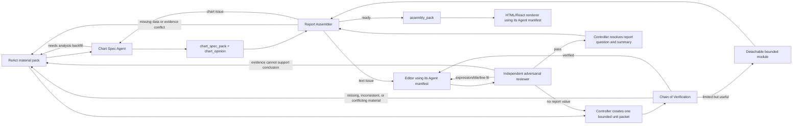

# Report Text Pack Contract

Use this contract after ReAct analysis and visual planning, and before HTML or
React markup. Version `0.4` separates report-level control, bounded unit writing,
independent adversarial review, detachable limited-evidence modules, and
deterministic validation. Evidence and verification remain internal; visible
section prose is an ordered sequence of complete conclusion sentences.

## Contents

1. Roles and runtime
2. Pipeline and bounded context
3. Chain of Verification
4. Unit writing and line fit
5. Independent adversarial review
6. Detachable bounded modules
7. Report-level title and summary
8. Decision boundary and HTML handoff
9. Harness boundary

## Roles And Runtime

| Role | Owns | Runtime manifest |
| --- | --- | --- |
| ReAct analysis Agent | Data, calculations, findings, causal strength, backfill | Existing analysis policy |
| Chart Spec Agent | Claim-bound chart specs and chart-side backfill opinions | `agents/chart-spec-agent/manifest.yaml` |
| Report Text Controller | Unit packets, verification routing, question resolution, report title and summary | `agents/report-text-controller/manifest.yaml` |
| Report Text Editor | One unit's complete conclusion sentences, title, subtitle, caption, and internal evidence lineage | `agents/report-text-editor/manifest.yaml` |
| Adversarial Reviewer | Independent challenge and route-back decision; no rewriting | `agents/report-text-adversarial-reviewer/manifest.yaml` |
| Report Assembler | Text-chart arbitration, route-back decision, and renderer handoff | `agents/report-assembler/manifest.yaml` |
| HTML/React renderer | Exact rendering of approved assembly handoff | `agents/html-report-renderer/manifest.yaml` |

Temperature is not a prompt instruction. Before every Agent call, load that
Agent's manifest and pass `execution.temperature` to the model runtime. Record
both configured and applied values in `execution_receipts`. If the host cannot
apply the manifest value, stop with `temperature_control_unavailable`.

## Pipeline And Bounded Context



The Controller may retain the material-pack index. A writer or reviewer receives
only one `unit_packet`: its question, selected findings, selected evidence,
selected visuals, layout position, and a minimal handoff. A unit normally has
one primary visual, but it may contain several tightly related visuals when they
jointly answer one question. Never pass the full analysis conversation or full
report material to every unit.

Each locked visual or chart spec records:

- `visual_id` or `chart_id`, `kind`, and `status: validated`;
- `claim_to_prove` and intended text-chart relationship;
- `data_ref`, unit, time scope, and comparison basis;
- required series, required annotations, focus metric, and fail-if-missing
  checks when the chart enters `chart_spec_pack`;
- chart-form prompt resource linkage, active color-system authority,
  conclusion-driven emphasis plan, and visual-check result;
- finding and evidence references;
- the intended report position.

The text and chart do not need to be copies of each other. They must be
mutually supportive: the chart may prove the same claim, support one key
evidence piece, complement the text with a decomposition, or explain a boundary.
The Report Assembler fails `mismatch` or `insufficient` relations before HTML.

## Chain Of Verification

Before writing, ask several concrete questions that could change the material or
conclusion. Do not use a fixed universal checklist; choose relevant roles such
as metric state, numerator, denominator, comparison, driver, counterevidence,
scope, or boundary.

A time pattern is not a driver. If a prospective conclusion names seasonality,
promotion, channel, price, volume, mix, cost, or another explanatory driver,
the verification record must include at least one completed question with
`role: driver_decomposition` that distinguishes the named path from relevant
alternatives. If the answer is missing or contradictory, return to ReAct before
writing the sentence.

Example for a profit-margin movement:

1. Did profit margin actually change, and over what period?
2. Did revenue change over the same period?
3. Did cost change, and by how much?
4. Did product mix, region, channel, or sample composition change?
5. Is there contradictory evidence outside the selected window?

Every verification question records its final answer, evidence, and status. Its
history may contain `missing` or `contradicted` states. Missing, internally
inconsistent, or materially conflicting evidence creates a consolidated
`backfill_request` to the ReAct analysis Agent. A hypothesis that is cleanly
contradicted by sufficient evidence is itself a resolved answer and does not
need synthetic backfill. Returned evidence is inserted into the bounded packet
and verified again.

Continue while another probe can materially change the conclusion. When a
critical question cannot be resolved but the known evidence still has report
value, move the unit to `bounded_modules`; do not leave it in normal `sections`.
When the unit has no report value, record `no_report_value` in
`controller_resolution.omitted_units` and do not render it.

Required verification shape:

```json
{
  "verification": {
    "status": "verified",
    "questions": [
      {
        "question_id": "q_margin",
        "question": "Did margin decline in the selected period?",
        "role": "metric_state",
        "critical": true,
        "final_status": "supported",
        "answer": "Margin declined during Q3 and narrowed in Q4.",
        "evidence_refs": ["e_margin"],
        "history": [
          {"round": 1, "status": "supported", "evidence_refs": ["e_margin"]}
        ]
      },
      {
        "question_id": "q_cost",
        "question": "Did cost move during the same period?",
        "role": "cost",
        "critical": true,
        "final_status": "supported",
        "answer": "Cost increased during the same window.",
        "evidence_refs": ["e_cost"],
        "history": [
          {"round": 1, "status": "missing", "evidence_refs": []},
          {"round": 2, "status": "supported", "evidence_refs": ["e_cost"]}
        ]
      }
    ],
    "backfill_requests": [
      {
        "request_id": "backfill_cost",
        "question_refs": ["q_cost"],
        "requested_data": "Cost by month for the selected category.",
        "status": "resolved",
        "returned_evidence_refs": ["e_cost"]
      }
    ],
    "unresolved_critical_question_refs": []
  }
}
```

## Unit Writing And Line Fit

Apply `report_writing_micro_prompt.md` before each unit. The Editor writes from
verified evidence, not from the full report narrative.

The evidence ledger, verification questions, logic chain, and render-plan
segments are internal Agent records. Never show them as reader-facing
`证据/结论/边界/判断` answer blocks.
Do not externalize writing-governance or validation-chain disclaimers such as
`以下结论只使用...`, `通过验证链...`, or `不延伸为...`. Those belong in reviewer
metadata or run logs, not in the report.

Reader-facing section prose lives only in `body_blocks`. Each block is one
complete sentence that ends with sentence punctuation, includes the minimum
data needed to understand its conclusion, and has one of these roles:

- `claim_sentence`;
- `context_sentence`;
- `authorized_strategy_sentence`, only after explicit user authorization.

When a unit has two conclusions, write sentence one and then sentence two in
the intended reading order. Do not split one conclusion into separate evidence,
conclusion, and boundary modules. Every sentence carries internal
`conclusion_refs`, `evidence_refs`, `display_mode`, and a `line_fit` plan so
provenance and geometry remain enforceable without becoming visible copy.
Use `display_mode=line` only when `planned_lines=1`. When the sentence cannot
fit cleanly in one visual line and further compression would remove evidence,
split the material into ordered `display_mode=point` blocks.

Every `unit_packet.layout_context` includes:

- report position and `grid_span`;
- available text width in pixels;
- maximum section-title lines;
- preferred conclusion lines, normally `1`.

Every conclusion includes a `render_plan`:

```json
{
  "render_plan": {
    "internal_only": true,
    "preferred_lines": 1,
    "planned_lines": 2,
    "split_mode": "evidence_conclusion",
    "split_reason": "The evidence and bounded conclusion do not fit one credible line.",
    "segments": [
      {"role": "evidence", "text": "Q3 margin fell while cost increased."},
      {"role": "conclusion", "text": "The verified pressure is concentrated in the Q3 cost window."}
    ]
  }
}
```

The actual HTML render still performs geometric line-count validation. This
aggregate plan exists only so the reviewer can inspect the unit's internal
compression logic; the renderer must never output its segment labels or text.
It renders only approved `body_blocks` sentences.

## Independent Adversarial Review

Run one separate reviewer context per unit. Give it the bounded unit packet,
verification record, and finished unit text, but not the writer's hidden
reasoning or full report context.

For thin-result handling, allow only these three categories:

1. `evidence_does_not_support_conclusion` -> return to `react`;
2. `expression_title_or_line_fit` -> return to `writer`; this category includes
   redundant expression, an inaccurate title, and uncontrolled wrapping;
3. `no_report_value` -> return to `controller` and omit the unit.

Do not introduce a generic `thin_conclusion` or other catch-all category.

The final review records:

```json
{
  "adversarial_review": {
    "reviewer_run_id": "review_section_1",
    "manifest_ref": "agents/report-text-adversarial-reviewer/manifest.yaml",
    "temperature": 0.2,
    "independent_context": true,
    "full_material_pack_received": false,
    "writer_reasoning_received": false,
    "verdict": "pass",
    "failure_category": null,
    "checks": {
      "expression": "pass",
      "data_evidence": "pass",
      "verification_logic": "pass",
      "business_context": "pass",
      "report_utility": "pass",
      "line_fit": "pass"
    },
    "issues": [],
    "route_on_fail": null
  }
}
```

A failed review chooses the route fixed by its failure category. The reviewer
never silently rewrites the text. A later accepted section records the resolved
route in `resolution_log`.

## Detachable Bounded Modules

`bounded_modules` is a sibling of normal `sections`, not a subsection of the
full report argument. Use it only when evidence is limited but still useful to
the reader. Every module must be removable and independently assemblable:

```json
{
  "module_id": "bounded_promotion_roi",
  "source_question_ref": "question_promotion_roi",
  "source_packet_ref": "packet_promotion_roi",
  "status": "bounded",
  "render_disposition": "detachable_boundary",
  "summary_eligible": false,
  "removable": true,
  "report_position": "detachable.after_main_report",
  "visual_refs": [],
  "evidence_refs": ["e_orders"],
  "unresolved_gap_refs": ["gap_campaign_cost"],
  "title": {
    "text_id": "text_bounded_title",
    "text": "促销活动回报证据尚不完整",
    "mode": "descriptive",
    "line_fit": {"max_lines": 2, "planned_lines": 1}
  },
  "statements": [
    {
      "text_id": "text_bounded_statement_1",
      "text": "促销期订单量发生了变化。",
      "evidence_refs": ["e_orders"],
      "line_fit": {"max_lines": 2, "planned_lines": 1}
    },
    {
      "text_id": "text_bounded_statement_2",
      "text": "由于缺少活动成本与净收入，现有数据无法确认活动回报。",
      "evidence_refs": [],
      "line_fit": {"max_lines": 2, "planned_lines": 1}
    }
  ]
}
```

The Report Assembler outputs normal sections and bounded modules into
`assembly_pack`. The HTML renderer outputs each module with
`data-module-type="bounded" data-removable="true"`. A bounded module cannot be
referenced by `summary_chain`, `report_title`, or `report_subtitle`.

## Report-Level Title And Summary

The Controller builds report-level text only after accepted normal-section
titles and subtitles exist. Do not require a fixed number of sections, visuals,
or summary paragraphs. Never use bounded-module text in the full-report summary.

Use a linked `summary_chain`. Each item references accepted title/subtitle IDs,
sections, and evidence. Roles may include:

1. `goal_attainment` — whether the report target was achieved;
2. `core_metric` — the most important metric state;
3. `key_question_answer` — the verified answer to the management question;
4. `solution` — only when explicitly requested and evidence-authorized;
5. `boundary` — what remains unresolved or out of scope.

Include only roles supported by the report. Preserve a progressive order and
link each item to the previous item. The Controller separately records every
report question as `answered`, `partially_answered`, or `unanswered`.

The report title and subtitle derive from the accepted `summary_chain`; they do
not need an arbitrary minimum number of charts. A claim title is allowed only
when its source summary and question resolution support it. Otherwise use a
neutral descriptive title.

## Required Top-Level Shape

```json
{
  "analysis_material_pack": {},
  "report_text_pack": {
    "contract_version": "0.4",
    "runtime_policy": {
      "temperature_source": "agent_manifests",
      "manifest_validation_status": "pass",
      "execution_receipts": {
        "chart": {},
        "controller": {},
        "writer": {},
        "reviewer": {},
        "assembler": {},
        "renderer": {}
      }
    },
    "prewrite_prompt": {
      "ref": "references/report_writing_micro_prompt.md",
      "version": "0.1",
      "applied": true
    },
    "report_goal": {},
    "controller_resolution": {},
    "visual_evidence": [],
    "sections": [],
    "bounded_modules": [],
    "summary_chain": [],
    "report_title": {},
    "report_subtitle": {},
    "recommendations": []
  }
}
```

## Decision Boundary And HTML Handoff

Default `decision_advice_mode` to `forbidden`. `management_implication` and
`recommended_use` remain analysis metadata, not automatic writing permission.
Only an explicit user request permits solution or strategy text, and every such
string remains bound to findings and evidence.

The renderer reads `agents/html-report-renderer/manifest.yaml`, then receives
the validated text pack, format contract, color system, and selected style. It
may add only fixed labels, units, sources, and section numbers. It may not draft,
compress, strengthen, or reorder analytical text. It renders section prose only
from `body_blocks` and must not expose verification questions, evidence ledgers,
logic-chain steps, or render-plan segments.

Bundled `sample.html` files are visual references, not runtime lineage outputs.

## Harness Boundary

`harness/report_text_validator.py` checks:

- the four Agent manifests and per-call execution receipts;
- unit packet reference containment and visual placement metadata;
- multiple verification questions, their histories, backfill, and unresolved
  critical questions;
- driver claims backed by explicit `driver_decomposition` verification;
- evidence and causal-strength containment;
- conclusion-to-verification and logic-chain references;
- complete unlabeled visible sentences, per-sentence line fit, internal-only
  split plans, and title line limits;
- independent adversarial review and all six checks;
- the three allowed thin-result routes and resolved route logs;
- detachable bounded-module fields and exclusion from the summary chain;
- linked, evidence-backed, progressively ordered summary items;
- explicit authorization for solution or recommendation text;
- obvious hype, rhetorical titles, responsibility claims, and filler patterns.

Harness cannot prove that a verification question is the best business
question, that the named driver is the best real-world explanation, that two
sentences are semantically equivalent, or that a planned line will actually
render without wrapping. The Controller and independent reviewer own those
semantic decisions; render-time geometry remains the final line-fit check.
