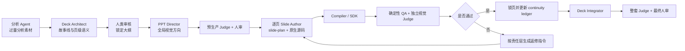
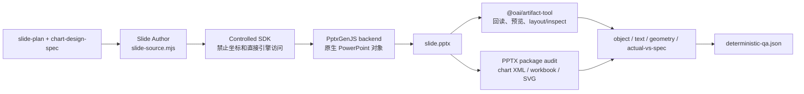

# PPT Agent 通用重设计确认方案

- 日期：2026-07-17
- 确认日期：2026-07-18
- 状态：用户已确认；阶段 0、阶段 1 已完成，阶段 2 单页 Compiler/QA 已完成开发与回归，等待用户视觉验收
- 当前开发边界：真实单页 PPTX、PPTX 派生预览和确定性报告已接通；阶段 3 的独立 Judge、锁页、顺序解锁和多页集成尚未实施
- 适用范围：从结构化数据分析素材到高质量、可编辑、咨询式 PowerPoint
- 不限定场景：归因、解释、对比、纯分析展示、管理建议、流程、矩阵、定性无数据内容

## 一句话结论

建议采用：

> 故事线先锁定，视觉表达逐页选择，Slide Author 直接制作，Compiler 只执行，确定性 QA 与视觉 Judge 独立审查。

保留五类模型角色，不再为模板选择、密度控制、对象规划、返修分别新增 Agent。当前真正缺少的不是更多角色，而是编码前强制生成并审核的 `slide-plan` 页面设计合同。

## 当前实施快照（2026-07-18）

| 项目 | 当前状态 | 已验证结果 |
| --- | --- | --- |
| Planner 视觉责任 | 已完成 | 新 Deck Outline v0.3 只输出证据语法、候选表达与编辑性要求；提前决定最终视觉会被拒绝 |
| PPT Director 视觉参考 | 已完成合同 | `deck-style-reference.svg` 与 `deck-chart-style-reference.svg` 为只读审查蓝图，哈希锁定且禁止进入 PPTX |
| Slide Author 页面计划 | 已完成 | 新运行必须先生成 `slide-plan.json`、`slide-reference.svg` 和所需图表合同，草稿计划不能进入源码阶段 |
| Chart Design UI | 已完成角色与合同 | 复杂图表按需调用，颜色、坐标轴、标签、参考线、标注、留白与编辑性均可验证 |
| 统一运行门禁 | 已完成 | 校验观点/证据覆盖、对象映射、SVG 哈希、连续性、字体下限、数据哈希、静态回退和作者/Judge 分离 |
| Renderer 边界 | 已完成最小回归 | 不支持的图表类型会失败且不生成 PPTX；审查 SVG 与自动静态回退被禁止 |
| 真实单页 Compiler | 已完成开发 | 受控 `slide-source.mjs` 可生成真实单页 PPTX；精确回读后输出对象、文本约束、几何、包体和 actual-vs-spec 报告 |
| 原生图表可编辑性 | 已完成硬门 | 计划中的图表必须产生 `ppt/charts/chart*.xml` 和嵌入式 Excel 工作簿，否则 QA 失败；禁止 SVG/PNG 静态替代 |
| Stage 2 验收样例 | 已生成，待人审 | 20 个计划对象全部匹配；原生图表、外置可编辑类目标签、KPI、解释线索、行动带和来源均可编辑；正式视觉 Judge 尚未写入 `judge-review.json` |

### Stage 2 P0 正确性加固

- `slide-source.mjs` 必须声明当前 `slide-plan.json` 的 `planSha256`；Compiler 向页面源码提供深冻结副本，页面 Agent 无法在运行时篡改坐标后再让 QA 按被篡改结果通过。
- 图表数据使用 `chart-data-json/0.1` 规范化；SDK 对实际 `categories`、系列名和数值重新计算 SHA-256，不能只比较源码自报的哈希字符串。
- `deterministic-qa.json` 同时记录计划、源码、图表设计、PPTX 与预览哈希，并单独给出 `source_plan_hash_matches`、`chart_data_content_verified` 和 `artifact_hashes_recorded` 判定。
- 确定性 QA 失败与视觉 Judge 失败共用最多两次自动返修预算；预算耗尽后进入 `human_required`，禁止无限重跑。
- 文字容器内边距已从 Author 源码提升为 `slide-plan.json` 的锁定字段 `content_insets_in`。带框文字容器水平边距不得低于 `0.12in`，垂直边距不得低于 `0.05in`；Compiler 负责转换成 PowerPoint 磅值，并从最终 PPTX 回读实际值核对。
- `slide-reference.svg` 必须同时展示容器外框和内部文字安全区。页面源码不得自行传入 `insets` 或 `margin`，避免视觉参考、源码和最终 PPTX 出现三套边距标准。

## 一、真实问题

目前的方向基本正确，但仍处于“合同已经分层，执行还没有闭环”的状态。

过去多轮返工并不是因为某一个模板不够好，而是中间缺少一份能够约束实际制作的页面设计结果。全局故事线只规定“这一页讲什么”，视觉方向只规定“整套 Deck 大致长什么样”，但 Slide Author 在真正写 PowerPoint 对象之前，仍要临场决定：

- 用什么视觉表达；
- 内容如何分组；
- 哪些对象互为父子容器；
- 图表、标注和解释分别放在哪里；
- 必须保留多少留白；
- 哪些对象必须原生可编辑；
- 哪些内容可以使用 AI 插画；
- 当前页如何继承上一页，又不机械重复。

这些决定没有先形成可审查合同，便直接进入代码和渲染，导致问题最终表现为单页补丁。

## 二、根因判断

| 退化表现 | 真实根因 |
| --- | --- |
| 页面不断回到固定类型 | Legacy Renderer 的 layout、archetype、module 仍和新链路共存，成熟执行能力主要还在旧路径 |
| 每张图都要单独修 | 返修没有按分析、故事、视觉、编译分层，问题默认都退给 Slide Author |
| Renderer 像模板填充器 | 历史上新 Author 只有合同和状态初始化；阶段 2 已用受控 SDK 补齐单页 Compiler，但视觉批准仍属于阶段 3 |
| 容器粗糙、图文分离 | 编码前没有对象清单、容器关系、空间保护区和证据绑定 |
| 信息密度提高后页面太满 | 只表达了语义密度，没有表达留白、注释通道、图表呼吸区和最小间距 |
| 规范存在但没有人真正负责 | 规则没有明确区分执行者、确定性检查者和视觉判断者 |
| QA 通过但视觉仍差 | 现有测试更擅长检查状态、哈希、身份和包结构，无法代替视觉判断 |
| 一页一个模型后跨页漂移 | 只有前页 handoff，没有累计的术语、证据使用、视觉模式和重复风险台账 |

## 三、过去流程与新流程

| 过去流程 | 新流程 |
| --- | --- |
| Planner 给页面结论，同时倾向给单一视觉类型 | Planner 只定义页面证明责任、证据语法和编辑性约束 |
| Slide Agent 选择 layout，Renderer 决定真实页面 | Slide Author 先提交 `slide-plan`，通过后再写原生对象源码 |
| 用 archetype 或模块数满足高密度 | 按内容节点和证据关系选择图表、表格、形状、矩阵、流程或插画 |
| 视觉问题继续增加规则或修某一页 | QA 检查硬正确性，Judge 检查表达质量，返修按责任层路由 |
| 只给下一页一个相邻 handoff | 同时提供全局只读上下文、前页 handoff 和累计 continuity ledger |
| 新路径失败后自动回旧模板 | Legacy 只允许人工显式调用，禁止静默降级 |



## 四、最小完整 Agent 架构

### 1. 分析 Agent

负责：

- 事实、数据、候选解释、证据、边界和数据缺口；
- 围绕分析目的进行饱和式下钻；
- 输出相对过量的分析素材；
- 记录为什么继续或停止某条分析分支。

禁止：

- 按 PPT 页数裁剪分析；
- 决定页面布局；
- 为填满页面而制造分析；
- 把弱证据写成强因果。

主要产物：

- `analysis_material_pack@0.2`
- 分析运行日志

### 2. Deck Architect

负责：

- 确定 Deck 论点和全局故事弧；
- 对分析素材执行 focus、merge、drop、backfill 决策；
- 把一页主结论作为大纲，把子结论、证据和边界作为细纲；
- 明确每一页要证明什么、读者看完后应得到什么判断；
- 把全局故事线提交人类审核。

禁止：

- 重算数据；
- 选择最终坐标；
- 固定 archetype；
- 指定卡片数量、图表数量或模块数量；
- 直接制作 PowerPoint。

主要产物：

- `deck-outline.json`
- 人类可读的大纲审核稿
- `page-context.json`

### 3. PPT Director

负责：

- 依据用户参考、受众、信息复杂度和页面类型多样性，定义整套 Deck 的视觉语言；
- 确定网格、标题层级、配色角色、字体、间距、留白、图表语言和标注语言；
- 区分全局不可变量与允许逐页变化的部分；
- 生成参考板或代表页方向，供人类确认。

禁止：

- 改变已批准结论；
- 直接完成全部页面；
- 规定固定模块数；
- 把视觉参考当作最终 PPT；
- 用一张整页图片代替可编辑页面。

主要产物：

- `visual-direction.json`
- `visual-direction-review.md`
- `deck-style-reference.svg`
- `deck-chart-style-reference.svg`
- 可选视觉参考板

### 4. Slide Author

负责：

- 一次只负责一页；
- 理解当前页证明责任、证据语法和前后页关系；
- 先生成 `slide-plan`，再生成原生 PowerPoint 对象源码；
- 在原生图表、表格、形状、连接线、矩阵、卡片、文本 exhibit 和 AI 插画之间做最终选择；
- 响应确定性 QA 与视觉 Judge 的合并返修意见。

禁止：

- 重算分析；
- 修改故事线；
- 自己批准自己；
- 在未生成 `slide-plan` 前直接编码；
- 把参考图、HTML 或 PNG 整页塞进 PPT；
- 让 AI 插画承担精确数据、图表、密集中文标签或来源说明。

主要产物：

- `slide-plan.json`
- `slide-reference.svg`
- 图表页的 `chart-design-spec.json` 和 `chart-reference.svg`
- `slide-source.mjs`
- 单页可编辑 PPTX
- `slide-handoff.json`

### 5. PPT Judge

负责三种只读审查模式：

1. 预生产审查：判断视觉方向是否能承载本 Deck 的内容密度和页面多样性；
2. 单页审查：判断真实 PPTX 预览中的层级、留白、阅读顺序、图文关系、标注、专业度；
3. 整套审查：判断跨页节奏、一致性、重复、术语和故事连续性。

禁止：

- 修改源码；
- 代替确定性 QA；
- 宽恕溢出、哈希、编辑性或证据绑定失败；
- 审核自己制作的页面。

主要产物：

- `judge-review.json`

## 五、非 Agent 服务

以下能力不应再包装成大模型 Agent：

| 服务 | 职责 |
| --- | --- |
| 状态机 | 控制批准、锁定、返修、stale、human_required 等状态 |
| Compiler / SDK | 把 Slide Author 源码编译为真实 PPTX，不做审美决策 |
| 确定性 QA | 检查包结构、对象、字体、溢出、重叠、裁切、编辑性、证据、哈希 |
| Deck Integrator | 合并已经锁定的页面，不重新设计 |

不新增以下 Agent：

- Visual Reference Agent
- Object Planner Agent
- Density Agent
- Revision Agent
- Template Selector Agent

这些分别属于 PPT Director、Slide Author 和状态机内部职责。继续拆分会增加成本、上下文传递和责任模糊，不会自动提升质量。

### 按需能力：Chart Design UI subagent

图表 UI 专家作为 Slide Author 的按需子能力存在，不升级为第六个顶层 Agent。

它负责：

- 按 UI Agent 的数据可视化心法和咨询行业标准设计复杂图表；
- 设计颜色语义、坐标轴、刻度、标签、参考线、网格线、图例或直标、标注和留白；
- 输出 `chart-design-spec.json` 和 `chart-reference.svg`；
- 明确图表区、绘图区、标签区、标注通道和保护区；
- 将设计绑定到当前 claim、数据和全局视觉方向的哈希。

它禁止：

- 修改、聚合、筛选或补造数据；
- 改变结论、证据强度、故事线或页面顺序；
- 生成最终静态图表替代原生 PowerPoint 图表；
- 批准自己设计的页面；
- 在 Compiler 错误时重新思考图表设计。

调用规则：

| 场景 | 执行方式 |
| --- | --- |
| Deck 全局图表语言 | PPT Director 每套 Deck 运行一次 `chart-system` 模式 |
| 简单单系列图 | Slide Author 依据已批准规则直接生成图表合同 |
| 复杂图表 | Slide Author 调用一次 Chart Design UI subagent |
| 图表设计返修 | 仅当 Judge 判定为图表设计问题时允许再调用一次 |
| Compiler 或对象生成错误 | 返回 Compiler，不重新调用 UI |

强制调用条件包括：多系列、超过 8 个标签、长中文类目、负值或跨零、参考线、多个标注、非零轴、双单位、分布/关系/区间语法、新图表语法、品牌色冲突，以及同一图表首次 Judge 未通过。

## 六、核心新增：slide-plan 页面设计合同

`slide-plan` 是新方案最关键的改动。它位于页级语义合同与 PowerPoint 源码之间。

### 必须包含

1. 页面目的和主结论；
2. 阅读顺序；
3. 选用的视觉表达及理由；
4. 对象清单；
5. 父子容器关系；
6. 每个对象的语义角色；
7. 每个对象绑定的 content node 和 evidence；
8. 可编辑性声明；
9. 空间计划；
10. 留白和保护区；
11. 图表标注通道；
12. AI 图片容器合同（仅在选用时）；
13. 与上一页的继承；
14. 给下一页的视觉和语义约束。

### 对象清单的最小字段

| 字段 | 说明 |
| --- | --- |
| `object_id` | 页面内唯一标识 |
| `type` | text、chart、table、shape、connector、image 等 |
| `role` | title、claim、evidence、annotation、implication、source 等 |
| `parent_id` | 所属容器或对象组 |
| `bbox` | 计划坐标与尺寸 |
| `content_node_refs` | 对应的观点节点 |
| `evidence_refs` | 对应的数据或证据 |
| `editability` | native editable、replaceable image 等 |

### 空间计划的最小要求

- 标题区、内容区、页脚区互不侵占；
- 图表四周保留可量化的呼吸区；
- 数据标签和标注预留独立通道；
- 对象不能靠缩小字体强行塞入；
- 信息密度由“结论、证据、边界和含义”的关系决定，不用对象数量代替；
- 当内容无法在可读条件下放入时，返回故事层重新合并或拆分，而不是让 Renderer 自行处理。

### SVG 视觉蓝图

本方案需要 SVG，但 SVG 的定位是**中间设计蓝图和坐标合同**，不是最终 PowerPoint 内容。

分为两层：

| SVG 产物 | 设计者 | 用途 |
| --- | --- | --- |
| `deck-style-reference.svg` | PPT Director | 展示整套 Deck 的网格、字体层级、颜色角色、容器语言和空间节奏 |
| `deck-chart-style-reference.svg` | PPT Director 的 `chart-system` 模式 | 展示全局图表颜色、轴、标签、参考线、标注和留白语言 |
| `slide-reference.svg` | 当前页 Slide Author | 固定当前页所有容器、对象位置、阅读顺序和视觉层级 |
| `chart-reference.svg` | Slide Author 或 Chart Design UI subagent | 固定当前图表的 plot、轴、标签、标注、图例和保护区 |

SVG 必须做到：

- 使用与 PowerPoint 页面一致的坐标系和画布比例；
- 每个容器和元素都有稳定 ID；
- 每个 ID 能映射到最终 PowerPoint 对象 ID；
- 固定 bbox、层级、父子关系、安全区和不可侵入区；
- 绑定 `claim_sha256`、`data_sha256` 和 `visual_direction_sha256`；
- 作为人类和 Judge 可直接审查的视觉样例；
- 通过哈希锁定，锁定后 Renderer 不得自行移动、缩放或重组容器。

SVG 不得：

- 作为整页图片插入最终 PPT；
- 作为静态图表替代原生可编辑 chart；
- 包含外部字体、位图、滤镜或无法映射的装饰对象；
- 与 `slide-plan`、`chart-design-spec` 形成两套独立设计事实。

设计事实源仍是 JSON 合同，SVG 是该合同的可视化投影。最终 PowerPoint 允许存在 Office 渲染产生的小像素差异，但关键坐标、对象关系、图表语义和视觉层级必须一致。

## 七、视觉表达选择放在哪

明确结论：

> 最终视觉表达选择应放在 Slide Author 的 `slide-plan` 层，不放在 Deck Architect，也不放在 Renderer。

Deck Architect 只表达证据语法和页面证明责任。PPT Director 提供整套视觉语言。Slide Author 根据当前页内容决定具体表达。Renderer 只执行已锁定方案。

| 内容和证据语法 | 默认优先表达 |
| --- | --- |
| 趋势、排名、数值比较 | 原生可编辑图表 |
| 精确查阅、多指标核对 | 原生表格 |
| 简单关系、层级、3-8 步流程 | 原生形状与连接线 |
| 定性对比、状态划分、策略取舍 | 原生矩阵、分栏或语义卡片 |
| 建议、行动、责任、节奏 | 行动表、流程或矩阵，按关系选择 |
| 纯定性结论 | 文本 exhibit 加少量原生形状 |
| 低文字概念解释 | 可选 AI 位图插画，必须进入锁定容器 |

“卡片”只是形状和文本的组合原语，不是页面 archetype。

v0.1 不允许复杂逻辑 SVG 或 `diagram_png` 成为最终交付路线，但允许并要求 SVG 作为中间视觉蓝图。无法用原生对象清晰表达时，应返回 `unsupported_visual`、`unsupported_native_chart` 或 `human_required`，而不是静默生成不可控图片。

### 图表 UI 设计合同

每张图表都必须有 `chart-design-spec.json`。是否调用 Chart Design UI subagent，只影响合同由谁生成。

最小字段包括：

- `grammar`：比较、排名、趋势、构成、关系、分布、差异或区间；
- `data_binding`：系列、类目、值、单位、精度、缺失值、排序和数据哈希；
- `geometry`：图表区、绘图区、轴区、标签区、图例区、标注通道和保护区；
- `color_mapping`：`dataNeutral`、`focus`、`benchmark`、`risk`、`positive`；
- `typography`：图表标题、轴、标签、标注和来源的字体与字号；
- `axes`、`ticks`、`labels`、`gridlines`；
- `legend_or_direct_labels`；
- `reference_lines`、`annotations`；
- `negative_zero_policy`、`whitespace_policy`；
- `editability`、`honesty_checks`、`allowed_deviations`；
- `svg_contract`：SVG 路径、哈希、坐标系和对象映射。

咨询行业图表稳定标准：

| 维度 | 规则 |
| --- | --- |
| 结论 | 一图一结论；takeaway 位于图表外，图表承担证据 |
| 颜色 | 最多两个焦点；红色只表示风险；绿色仅在正向确有业务含义时使用 |
| 轴与刻度 | 柱状图必须含零点；折线截断必须声明；通常保留 4-7 个主刻度；双轴默认禁止 |
| 标签 | 数据标签不低于 9pt，轴不低于 10pt，来源不低于 8pt；缺失值不得显示为零 |
| 参考线 | 使用低对比 benchmark 色并靠边直标，不得成为视觉中心 |
| 标注 | 最多两个决策级标注；必须绑定点、系列、区间或对象，并使用引线或独立通道 |
| 网格线 | 排名图默认无网格；趋势图只保留浅色主网格；禁止密集次网格 |
| 图例 | 单系列禁用；优先直标；图例顺序必须与图形顺序一致 |
| 留白 | 为标签、直标和标注预留独立通道，禁止靠缩字解决空间不足 |
| 负值与零线 | 零线比网格线清楚、比数据弱；仅当负值确实表示风险时使用红色 |
| 数据诚实 | 禁止 3D、截断柱、无说明平滑、不等宽分箱、隐藏基数和混淆零与缺失 |

图表语法决定表现方式，不使用“销售复盘页”“经营诊断页”等封闭业务 archetype：

| 数据语法 | 默认设计规则 |
| --- | --- |
| 比较/排名 | 长标签优先横向条形；按值排序或声明语义顺序；直接数据标签；通常无网格 |
| 时间趋势 | 保持时间顺序；缺失处断线；重点标终点和转折点；禁止无说明平滑 |
| 构成 | 优先堆叠或 100% 堆叠并说明分母；饼图仅限不超过 6 类 |
| 关系 | 散点或气泡必须有两个定量轴、样本量和尺寸图例；只标关键点 |
| 分布 | 等宽分箱并显示样本量；中位数、四分位和异常值语义明确 |
| 差异/区间 | 明确零线、正负方向、区间端点和不确定性 |

### 提示词修改范围

| Prompt 或合同 | 必须增加的指令 |
| --- | --- |
| PPT Director | 增加 `chart_system`、语义色、轴/标签/标注语言和全局 SVG 样例；样例只能使用明确标记的模拟数据，不能形成固定页面模板 |
| Slide Author | 强制执行 `slide-plan -> chart-design-spec -> chart-reference.svg -> slide-reference.svg -> source`；负责判断是否调用 Chart Design UI，并对采纳结果负责 |
| Chart Design UI | 新增页级能力 Prompt；只能设计图表编码、样式和空间，不得修改数据、结论、故事或批准状态 |
| PPT Judge | 对照合同和 SVG 检查最终 PPT 的视觉执行；不得编辑 SVG、提供源码或代替 QA |
| Deck Integrator | 检查跨页颜色语义、单位、字体和直标规则一致，并确认 SVG 未进入 PPT 包 |
| Authoring Contract/Schema | 新增 `slide-plan`、两个 SVG、`chart-design-spec`、输入哈希和对象映射 |
| Renderer/QA | 读取图表合同，输出 `actual-vs-spec.json`，修正图表专项字号优先级 |

可直接合入 Slide Author 和 Chart Design UI 的核心提示词增量：

```markdown
## Chart Design UI Contract

图表设计是 Slide Author 的页级能力，不是新的顶层工作流角色。
每个图表页必须先生成 chart-design-spec.json 和 chart-reference.svg，
再生成 slide-reference.svg 与 PowerPoint 对象源码。

PPT Director 每套 Deck 只定义一次 chart_system、
deck-style-reference.svg 和 deck-chart-style-reference.svg。
Slide Author 对简单图表使用已批准规则；
复杂图表按触发条件调用独立 Chart Design UI 实例。

Chart Design UI 只能决定图表语法、颜色映射、轴、刻度、标签、
参考线、网格线、图例或直标、标注、留白、字体及负值/零线表达。
不得修改数据、单位、证据、结论、故事线或页面顺序，不得批准页面。

所有设计必须绑定 claim_sha256、data_sha256 和 visual_direction_sha256。
图表主体优先为原生 PowerPoint chart；
标题、直标、参考线和标注使用原生可编辑文本、线条和形状。
SVG 仅是中间视觉蓝图和坐标合同，不得作为最终媒体插入 PPTX。

柱状图必须包含零点；红色仅表示风险；单系列不得循环配色；
焦点不超过两个；数据标签不得小于 9pt；来源不得小于 8pt；
标注必须绑定目标；缺失值不得伪装为零。

无法用 Compiler 支持的原生对象诚实实现时，
返回 unsupported_native_chart 或 human_required。

Deterministic QA 检查 spec、SVG、源码和 PPTX 的数据、对象、坐标、
样式、哈希和编辑性。PPT Judge 只审查最终 PPT 是否正确执行该设计
及其沟通质量，不设计 SVG、不修改源码。

任何未声明偏差、静态图替代、SVG 入包或数据哈希变化均为硬失败。
```

## 八、谁执行规范，谁判断

| 规范 | 执行者 | 判断者 |
| --- | --- | --- |
| 故事线与证据不漂移 | Deck Architect、Slide Author | Outline Validator、Evidence Validator、人类 |
| 全局视觉方向 | PPT Director | Pre-production Judge、人类 |
| 页级构图、容器和空间 | Slide Author | Geometry/Space Validator、PPT Judge |
| 复杂图表视觉设计 | Chart Design UI subagent，Slide Author 对采纳结果负责 | Chart Validator、PPT Judge |
| SVG 视觉蓝图执行 | Slide Author、Compiler / SDK | Actual-vs-Spec Validator、PPT Judge |
| 原生对象与可编辑性 | Compiler / SDK | Package/Editability Validator |
| AI 图片锁定容器 | Slide Author 提议，状态机锁定 | Container Validator、PPT Judge |
| 跨页连续性 | Slide Author、Deck Integrator | Continuity Validator、Deck Judge、人类 |
| 最终交付 | Deck Integrator | 所有硬门通过后由人类验收 |

确定性 QA 不能宣布页面“好看”。视觉 Judge 也不能忽略确定性失败。

## 九、一页一个 Subagent 的继承机制

每个页级 Slide Author 只读取：

- 不可变的 Deck thesis；
- 已批准的故事弧；
- 全局术语表；
- 已批准的视觉方向；
- 当前页完整 page context；
- 上一页 handoff 和真实预览哈希；
- 下一页目标预告；
- 累计 `deck-continuity-ledger`。

不把完整分析素材库重复塞入每个页级上下文，避免注意力漂移和成本失控。

### continuity ledger 保存

- 已使用的 claim；
- 已使用证据及首次出现页；
- 术语和单位；
- 已使用视觉模式；
- 色彩角色；
- 重复风险；
- 已确认的跨页承接关系。

上游已锁定页面发生变化时，后续页面全部标记为 `stale`，不得继续沿用旧 handoff。

## 十、返修责任路由

返修不能全部退给 Slide Author。每条问题必须先分类：

| 问题类型 | 返回位置 |
| --- | --- |
| 数据错误、证据不足、因果过强 | 分析 Agent |
| 主结论不清、拆页不合理、故事断裂 | Deck Architect |
| 全局视觉语言不能承载内容 | PPT Director |
| 单页构图、阅读顺序、图文关系问题 | 当前页 Slide Author |
| 对象生成、字体、坐标、包结构、编辑性错误 | Compiler / SDK |
| 超过两轮仍未收敛或需要改已批准内容 | 人类 |

第二次出现同类错误时，停止继续加单页补丁，必须检查共同上游根因。

## 十一、成本与过度思考控制

- PPT Director 每套 Deck 只运行一次；
- Judge 复用同一角色的三种模式，但实例必须与 Author 分离；
- 每页最多两轮自动返修；
- 确定性 QA 和 Judge 的问题合并后一次返还，避免串行往返；
- 简单页面使用稳定配置，复杂模型只用于关系复杂页面；
- 不按业务名称固定模型强度；
- 新视觉方向或新 Compiler 版本先测试两页：
  - 一页最高复杂度数据页；
  - 一页非图表、定性或建议页；
- 两张代表页通过后才批量生产；
- 复用已批准且版本未变化的方向时，可以跳过代表页门禁，但不能跳过单页 QA 和 Judge。

## 十二、标准中间产物

| 产物 | 人类审查重点 | 机器检查重点 |
| --- | --- | --- |
| `deck-outline.json` | 故事是否成立、每页是否有价值 | 页面、材料和证据引用完整 |
| `visual-direction.json` | 风格是否符合受众和用户语气 | 版本、来源、规则和批准哈希 |
| `page-context.json` | 当前页要证明什么 | claim、节点、证据和边界 |
| `slide-plan.json` | 构图、空间、对象和视觉选择 | 对象字段、容器关系、bbox、编辑性 |
| `ai-image-container.json` | 图片是否只是辅助表达 | 比例、安全区、零裁切、可替换 |
| `deterministic-qa.json` | 无需做审美判断 | 实际检查项和对象级错误 |
| `judge-review.json` | 沟通效果与视觉质量 | 结构化问题、严重级别和区域引用 |
| `revision-directive.json` | 是否修对责任层 | 来源、目标对象、预期结果、轮次 |
| `slide-handoff.json` | 跨页承接是否清楚 | claim、证据、术语和哈希 |
| `deck-continuity-ledger.json` | 全局是否连贯 | 重复、漂移、单位和证据使用 |

所有人类审核 Markdown 必须由对应 JSON 生成，不允许 Agent 另外写一份可能漂移的总结。

## 十三、分阶段修改计划

| 阶段 | 修改范围 | 通过标准 | 回退方式 |
| --- | --- | --- | --- |
| 阶段 0：合同收敛（已完成） | 清理新链路中的 `diagram_png/SVG` 冲突，隔离 legacy，统一四个 Skill 口径 | Planner v0.3、Author run v0.2 与 Renderer 边界回归通过 | 仅回退本阶段合同和文档 |
| 阶段 1：中间产物（已完成） | 增加 slide-plan、对象清单、空间计划、continuity ledger、返修指令合同和 Validator | 对象、证据、编辑性、空间计划、SVG 映射与图表合同可检查 | 保留旧 outline 读取适配 |
| 阶段 2：Compiler/QA（已完成开发，待人审） | 建立真实单页编译、PPTX 预览、对象、文本约束、几何和包体报告入口 | 同一 source 产生匹配哈希的 PPTX 与 preview；原生 chart XML、工作簿、SVG 排除和坐标误差通过 | 保留显式 legacy 命令 |
| 阶段 3：Author 闭环 | 接通逐页实例、双审、责任路由、锁页和图片容器 | 自制自审被拦截，两轮上限生效，顺序解锁 | 关闭新入口，不删除产物 |
| 阶段 4：跨场景验收 | 用不同内容语法做 holdout 测试 | 不依赖固定页数、archetype 或模块数 | 新链路暂不设为默认 |
| 阶段 5：默认迁移 | 更新索引、Runner 和正式入口 | 新链路默认，legacy 仅人工显式调用 | 切回旧入口 |

## 十四、跨场景验收集

最终不能只用一个销售复盘 PPT 验收。至少覆盖：

1. 指标下降归因；
2. 概念或机制解释；
3. 两类对象对比；
4. 纯分析展示；
5. 管理建议与行动优先级；
6. 流程和责任关系；
7. 2x2 或多维矩阵；
8. 无数据的定性结论；
9. 高密度原生图表页；
10. 低文字 AI 插画辅助页。

通用通过标准：

- 页面数量来自故事和证据，不来自模板；
- 不要求固定图表、卡片或模块数量；
- 主结论、证据、边界和管理含义关系清楚；
- 信息密度高，但图表和模块有可见留白；
- 文字、图表、表格、形状和简单关系原生可编辑；
- AI 插画只作为独立可替换辅助对象；
- 无整页截图；
- 无 Author 自审；
- 确定性 QA 和视觉 Judge 都通过；
- 最终由人类验收。

## 十五、实施影响

预计影响的主要模块：

| 模块 | 主要改动 |
| --- | --- |
| `data-analysis-report-agent` | 只补交付边界和返修路由，不让分析层承担 PPT 设计 |
| `data-report-presentation-planner` | 收敛视觉字段为证据语法和编辑性约束，升级 page context 与 continuity 初始信息 |
| `data-report-ppt-author` | 新增强制 slide-plan、对象和空间计划、返修路由及页级闭环 |
| `data-report-pptx-renderer` | 明确 Compiler/SDK 路径，隔离 legacy，增强对象、几何和编辑性报告 |
| 索引中心和 Runner 映射 | 已更新能力描述和新合同产物；是否彻底移除 legacy 默认入口仍留到跨场景验收后决定 |

当前仓库存在既有未提交修改。本轮已按差异清单增量开发，没有覆盖或回滚用户已有改动。

### 阶段 2 实施记录（2026-07-18）

真实单页链路已经形成：



Stage 2 验收样例：

- 运行目录：`D:\知识库\work\data-analysis-report-agent\outputs\ppt-author-stage2-consulting-demo-20260718`
- 可编辑 PPTX：`pages/page-01/slide.pptx`
- PPTX 派生预览：`pages/page-01/preview.png`
- 页面内容：单行结论标题、3 个 KPI、1 个原生正负柱状图、3 条解释线索、1 条行动结论和可见来源
- 对象核对：计划 20 个、源码发出 20 个、PPTX 回读 20 个
- 图表核对：存在原生 chart XML 和嵌入式 Excel 工作簿
- 几何核对：所有对象在 `0.02in` 容差内，无未声明对象和未声明位移
- 文本核对：标题单行，所有声明了 `text_constraints` 的容器满足最大行数和最小字号
- 包体核对：无 SVG、无整页位图、预览来自同一 PPTX
- 外部回归：官方 `slides_test.py` 未发现溢出

阶段 2 解决的是“计划能否被稳定编译为真实可编辑 PPTX，并证明没有漂移”，不解决“页面是否已经达到最终审美”。视觉好坏仍必须由阶段 3 的独立 Judge 与用户判断。

### 代码影响矩阵

| 文件或模块 | 目的 | 上下游影响 | 验证 | 回退 |
| --- | --- | --- | --- | --- |
| `data-report-pptx-renderer/sdk/controlled_slide_sdk.mjs` | 限制对象 API，坐标只读计划，生成原生文本/形状/表格/图表 | Slide Author 不能直接调用引擎；Compiler 获得稳定对象记录 | Stage 2 集成测试、真实样例 | 回退本文件并关闭新 Compiler 入口 |
| `data-report-pptx-renderer/scripts/compile_authoring_page.mjs` | 单页编译、PPTX 回读和多报告 QA | Author 状态可进入 `qa_review`；失败返回 `revise` | package/object/geometry/text/actual-vs-spec 全通过 | 保留 legacy 命令，不自动切换 |
| `data-report-ppt-author/scripts/compile_authoring_page.py` | Author 侧前后置合同验证 | 防止跳过计划、身份和哈希门禁 | `AUTHORING_PAGE_COMPILED` | 停用包装入口 |
| `slide_plan.schema.json` 与 Author Validator | 增加对象报告路径和 `text_constraints` | 标题单行、最小字号与溢出策略成为页级合同 | 正负向契约测试 | 删除新增可选字段不影响旧合同 |
| `build_stage2_acceptance_demo.py` | 生成可复现咨询页样例 | 只写外部 outputs，不污染 skill 包 | 重建后哈希、QA 和视觉预览一致 | 删除外部运行目录 |

## 十六、需要用户确认

### 决策 1

保留五类模型角色：

- 分析 Agent
- Deck Architect
- PPT Director
- Slide Author
- PPT Judge

Compiler、QA、状态机和 Integrator 作为确定性服务，不再增加 Agent。

用户确认：已通过（2026-07-18）。

### 决策 2

新增强制 `slide-plan.json` 门禁。最终视觉选择从 Planner 移交给 Slide Author；未完成页面设计合同，不允许写源码或生成 AI 插画。

用户确认：已通过（2026-07-18）。

### 决策 3

新视觉方向或新 Compiler 版本必须先通过两张代表页。Legacy 只能人工显式调用，禁止失败后自动降级。

用户确认：已通过（2026-07-18）。

### 决策 4

允许 SVG 作为中间视觉蓝图和坐标合同，但禁止作为整页或静态图表插入最终 PPT；复杂图表按需调用从属于 Slide Author 的 Chart Design UI subagent，并将 UI Agent 心法和咨询行业图表标准写入稳定 Prompt。

用户确认：已通过（2026-07-18）。

## 产品经理最终建议

这次不应继续增加视觉类型、模板或固定页面规范。`slide-plan`、受控 Compiler 和确定性 QA 已经做实，下一阶段应集中接通独立视觉 Judge、责任路由和锁页状态机。

建议的开发顺序是：

1. 先统一合同；
2. 再建立页面设计合同；
3. 真实 Compiler 已接通，下一步完成双审与锁页；
4. 最后用跨场景样本决定是否设为默认。

决策 1-4 已由用户确认。阶段 0、阶段 1 已完成；阶段 2 已完成开发、结构回归和可视化样例，等待用户验收。验收通过后进入阶段 3：独立 PPT Judge、最多两轮返修、锁页和顺序解锁。
